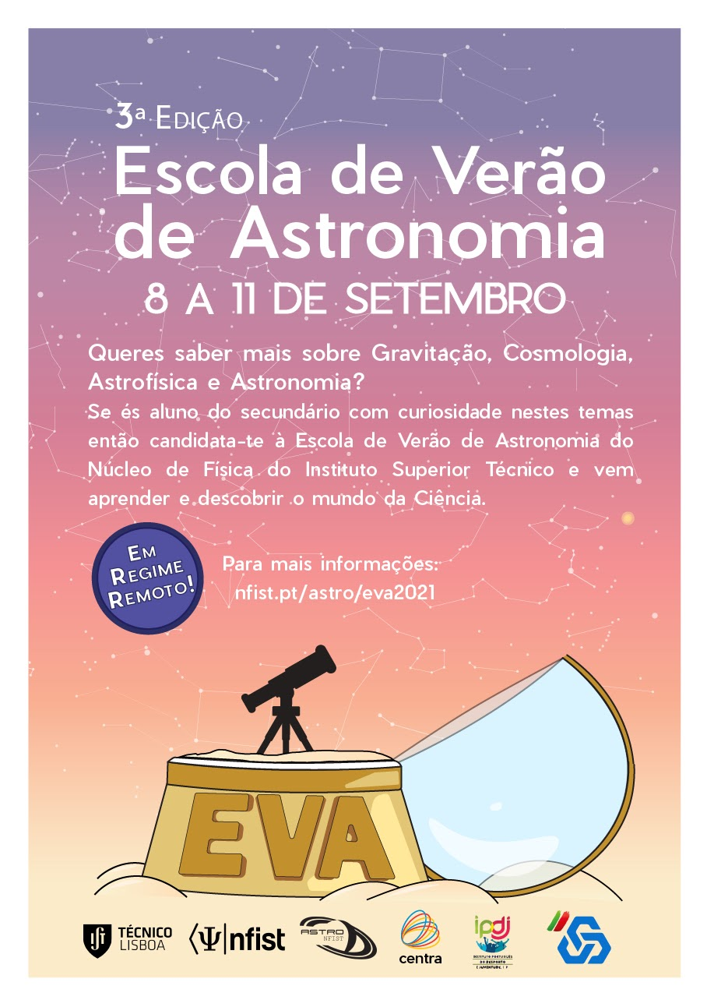
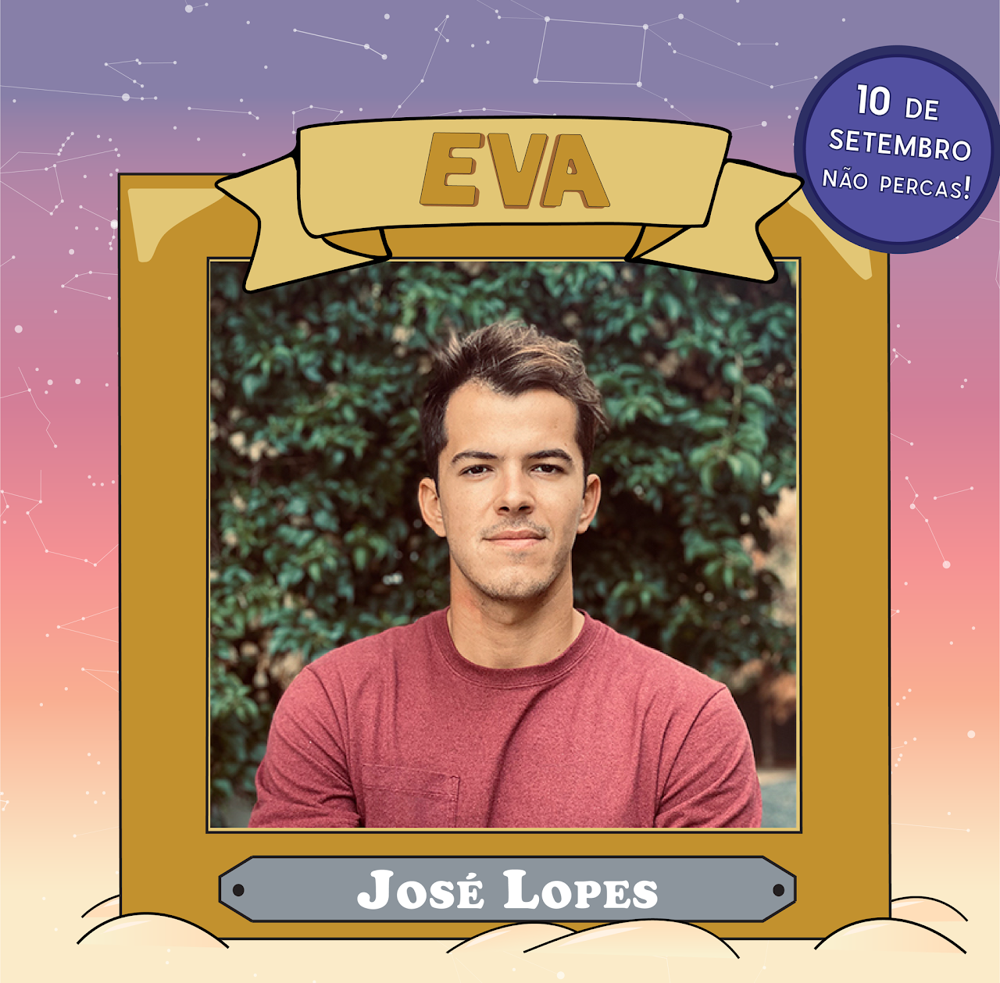
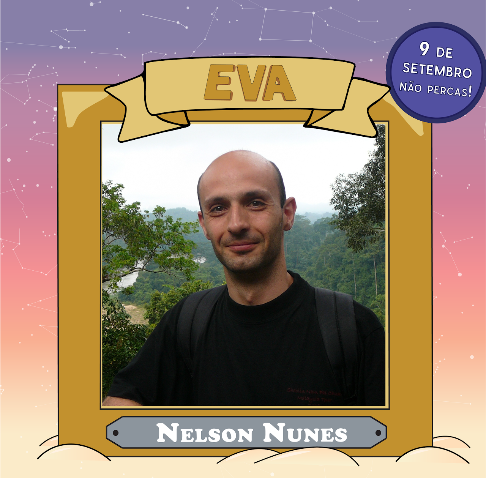
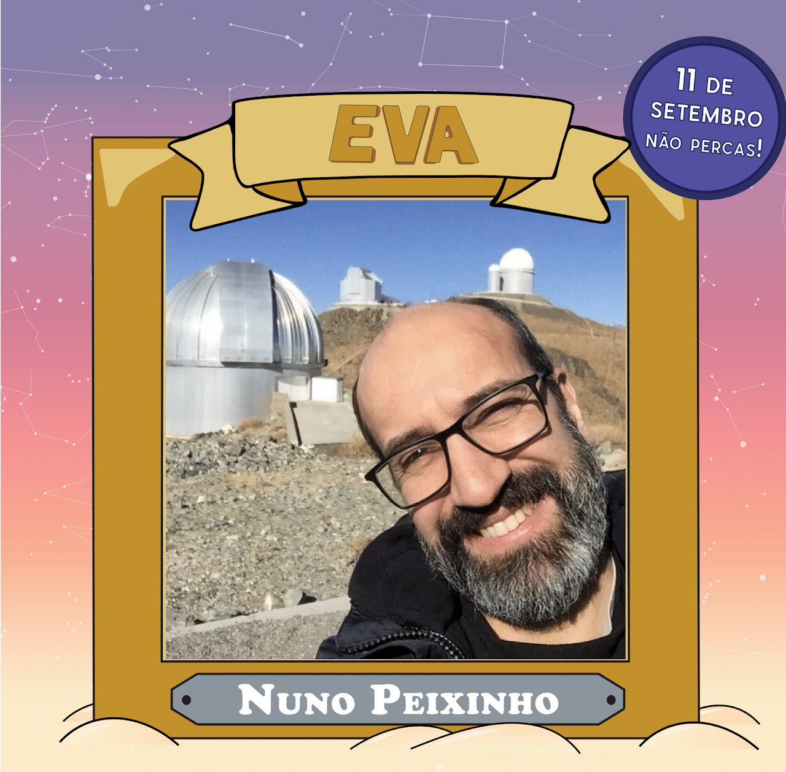
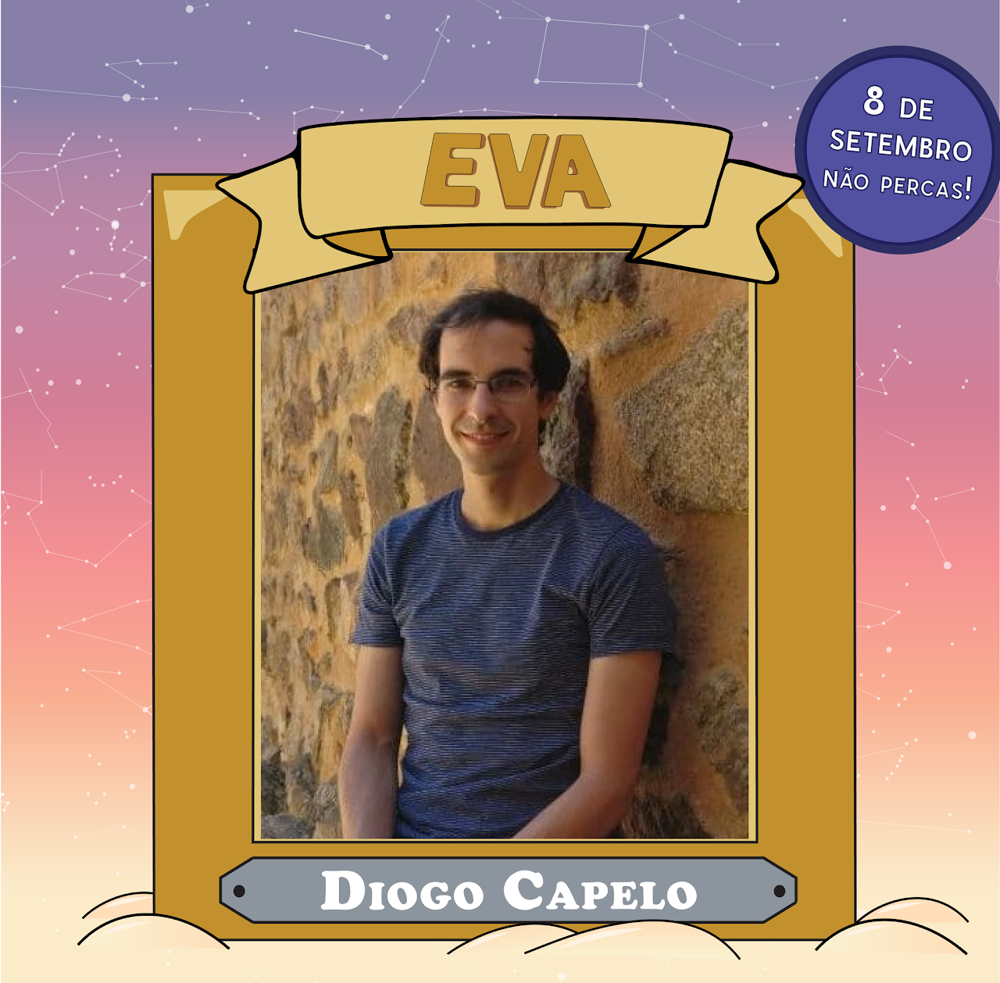
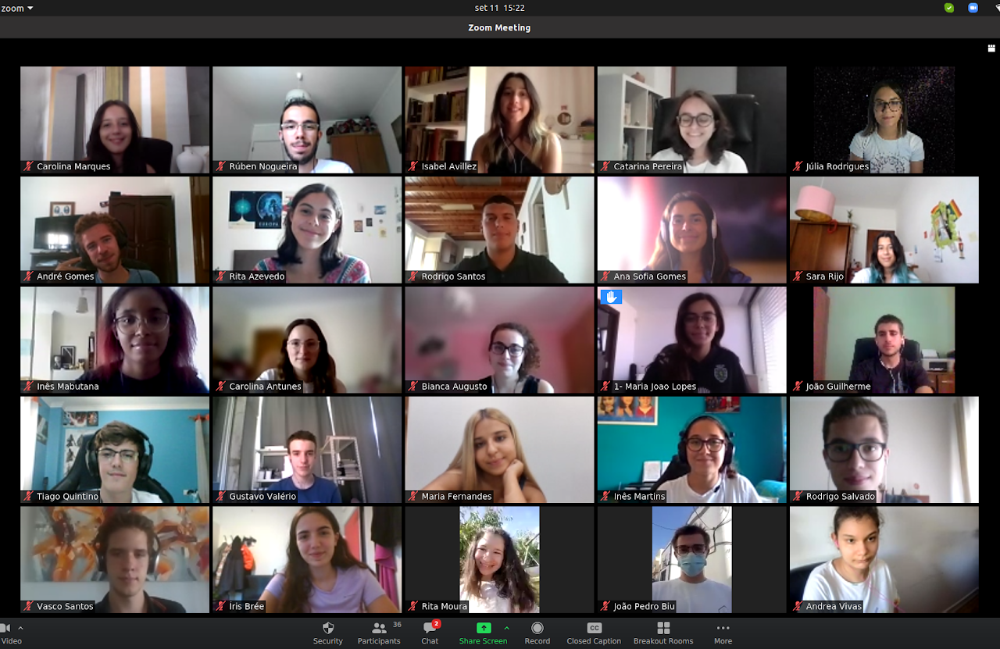
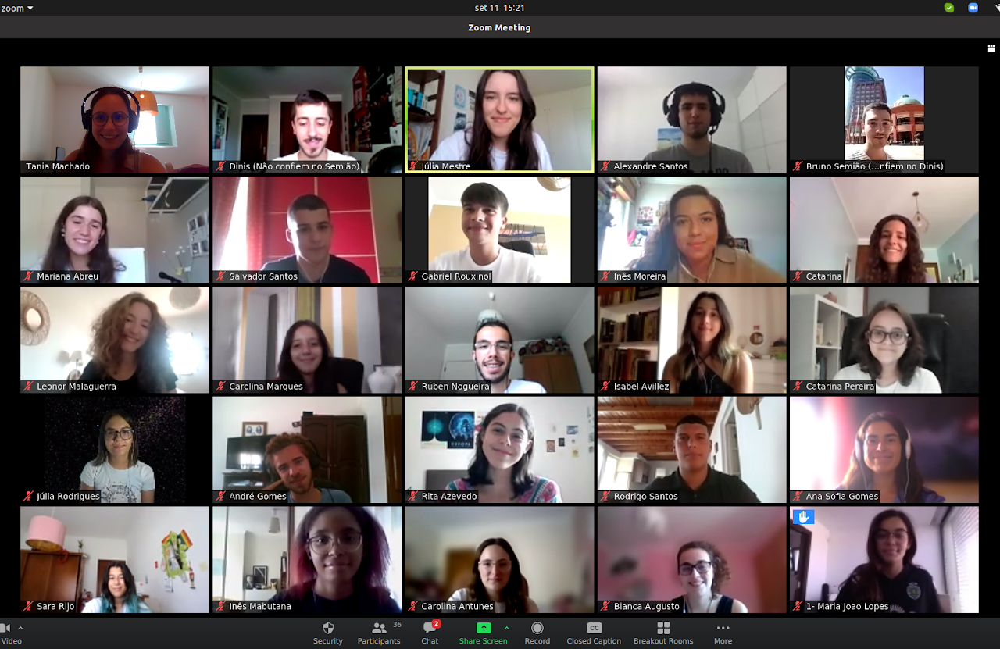

Nos dias **<u>8, 9, 10 e 11 de setembro</u>** decorreu a terceira edição da **<u>EVA -Escola de Verão de Astronomia 2021</u>**.

Foram selecionados **<u>26 alunos do ensino secundário de Portugal</u>**, com curiosidade por astronomia, para integrar esta escola.

Ao longo dos quatro dias, tiveram a oportunidade de aprender sobre diversos tópicos de astronomia e astrofísica, desde coordenadas celestes a gravitação. Foram dinamizadas palestras, dadas por professores da área e alunos de doutoramento, e sessões de resolução de exercícios bem como workshops de introdução a Python e aplicações, por alunos de física. Este ano os participantes tiveram um dia dedicado a Cosmologia, uma novidade em relação às edições anteriores, e uma sessão de observação noturna e de astrofotografia remota.

O NFIST agradece a todos os colaboradores que tornaram esta edição online possível e a todos os participantes pela curiosidade e empenho.

---

## Feedback 🎙️

```
Adorei! Eu não recomendava, eu já recomendei. Foram incansáveis
connosco e fizeram um excelente trabalho na transmissão dos
conhecimentos e na escolha dos oradores. Todas as palestras
foram bastante educativas e de extremo interesse. A resolução
de exercícios que fazemos na escola foi uma das coisas que mais
gostei uma vez que eram bastante desafiadores e bem construídos.
Os workshops foram criativos e realço a ajuda dos colaboradores
tanto nos exercícios como no workshop (e até no dia de conversa):
eram bastante simpáticos, motivadores e ajudaram no esclarecimento
de possíveis aspetos menos consolidados; sem eles não teria sido
possível grande parte do trabalho.
```

**<u>Anónimo</u>**

```
A EVA ajudou-me a perceber que é fisica que quero seguir!
É uma escola exigente sem dúvida, mas acho que nos prepara
para o que podemos esperar na universidade.
```

**<u>Anónimo</u>**

```
Foi uma experiência incrível, quando me candidatei sabia que
ia aprender, só não estava à espera de tanto!
```

**<u>Anónimo</u>**

```
Todas as palestras são cuidadosamente preparadas e os organizadores
estão sempre por perto para nos guiar. É uma experiência enriquecedora
e completamente fora da caixa!
```

**<u>Anónimo</u>**

```
A EVA foi uma experiência fantástica e permitiu-me alcançar um nível
de conhecimentos que de outra forma não seria possível neste momento
e graças à EVA tenho mais "ferramentas" que posso usar no futuro para
aprender ainda mais. Recomendo vivamente a EVA para os gostam de
Astronomia e não há que recear não possuir conhecimentos suficientes
pois os colaboradores ajudam imenso com qualquer tipo de dúvida
que tenhamos.
```

**<u>Anónimo</u>**

---

## Galeria de Imagens 📸

<div style="display: flex;">
    <div style="flex-basis: 48%;  margin-right: 2%;">
        
    </div>
    <div style="flex-basis: 48%;  margin-right: 2%;">
        
    </div>
</div>

<div style="display: flex;">
    <div style="flex-basis: 48%;  margin-right: 2%;">
        
        
    </div>
    <div style="flex-basis: 48%;  margin-right: 2%;">
        
        
    </div>
</div>

<div style="display: flex;">
    <div style="flex-basis: 48%;  margin-right: 2%;">
        
    </div>
    <div style="flex-basis: 48%;  margin-right: 2%;">
        
    </div>
</div>
