Nos dias 4 a 8 de setembro irá decorrer a quinta edição da EVA -Escola de Verão de Astronomia.

Foram selecionados alunos do ensino secundário de todo o país, com curiosidade por astronomia, para frequentar esta escola. De seguida, apresentamos a lista dos alunos selecionados para a EVA. Todos os candidatos deverão ter recebido um e-mail sobre o estado da sua candidatura, se não o tiveres recebido envia-nos um e-mail para: astro.nfist@gmail.com.

---

## Candidaturas Aprovadas 🎉

    

        <ul>
            <li>Ana Silva</li>
            <li>Carolina Araújo</li>
            <li>Catarina Império</li>
            <li>Inês Nabais</li>
            <li>Inês Figueiró</li>
            <li>Bruno Fontenele</li>
            <li>César Correia</li>
            <li>Pedro Herdeiro</li>
            <li>Martim Vicente</li>
            <li>Vicente Rasteiro</li>
            <li>Inês Belo</li>
            <li>Constança Reis</li>
            <li>Mariana Maio</li>
            <li>Laura Oliveira</li>
            <li>Catarina Dias</li>
        </ul>
    

        

        <ul>
            <li>Rita Gomes</li>
            <li>Sofia Obrist</li>
            <li>Maria Gonçalves</li>
            <li>Laura Baptista</li>
            <li>Rafaela Santos</li>
            <li>Rodrigo Santos</li>
            <li>Luis Brandão</li>
            <li>Manuel Brasão</li>
            <li>Tomás Santos</li>
            <li>Jaime Antunes</li>
            <li>Henrique Pereira</li>
            <li>Tiago Marques</li>
            <li>Manuel Neto</li>
            <li>Jhit Naguindás</li>
            <li>José Brito</li>
        </ul>
    

---

## Detalhes da EVA 🌌

Ao longo dos próximos dias iremos partilhar aqui todos os detalhes importantes sobre a EVA! A EVA está repleta de atividades e temos muito a dizer sobre cada uma, garante que não perdes nada ;) Para já podes ficar a conhecer os palestrantes de Astrofísica, Astronomia, Gravitação e Cosmologia.

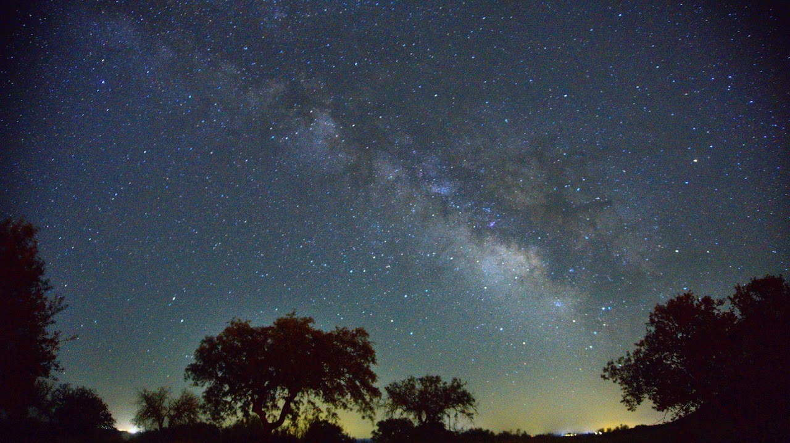

---

## Galeria de Imagens 📸

---

## Cartaz 📜

    

        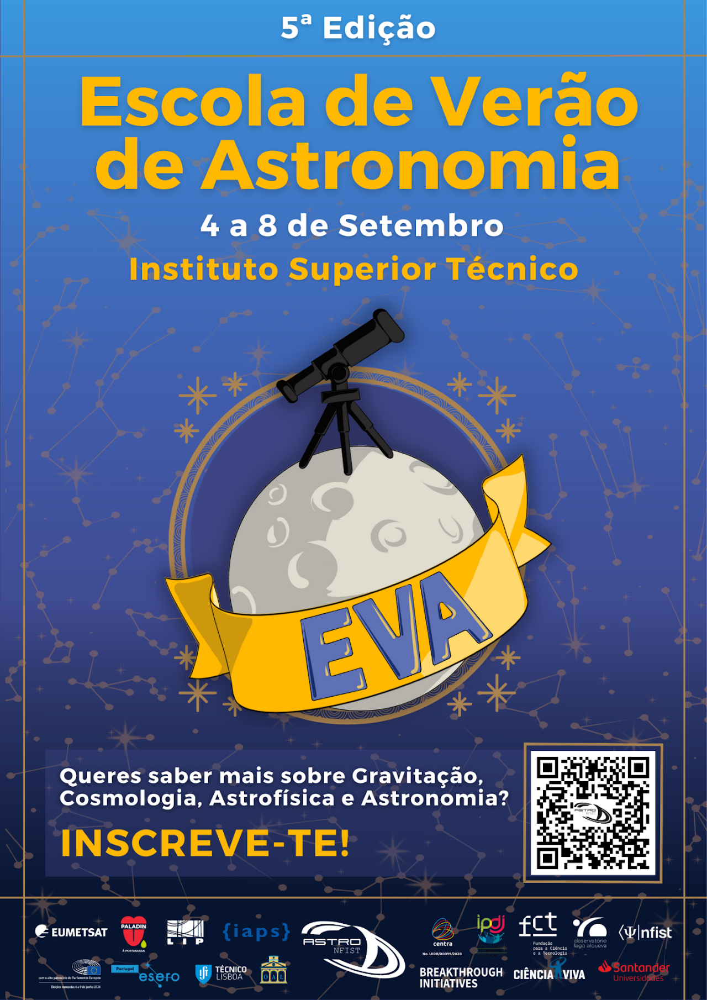
    

    

        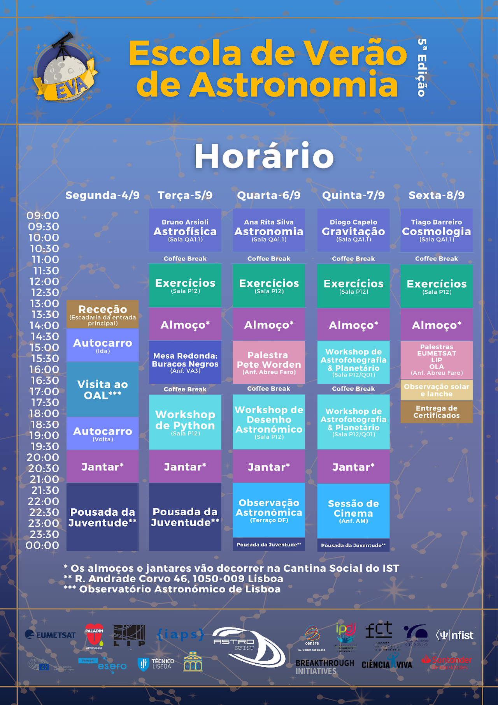
    

---

## Eventos 🎉

---

## Mesa Redonda - Buracos Negros ⚫️

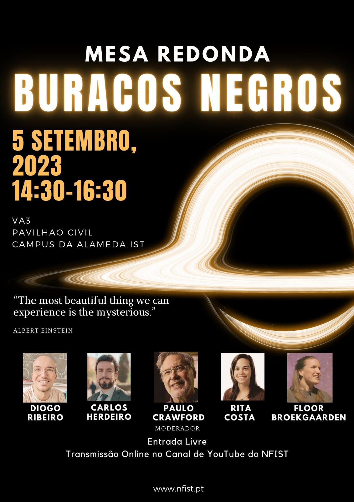

É com grande entusiasmo que anunciamos esta Mesa Redonda sobre um tema que desperta o interesse de todos: os enigmáticos Buracos Negros. Estes gigantes cósmicos, verdadeiros devoradores de luz, têm intrigado cientistas por gerações, desafiando a nossa compreensão do Universo e desvendando mistérios que vão além da nossa imaginação.

Nesta Mesa Redonda, teremos a honra de contar com a presença de renomeados especialistas que nos guiarão numa conversa que abordará as diferentes perspectivas da comunidade científica sobre vários tópicos relacionados com buracos negros, como a sua formação e evolução, e com fenómenos associados e outras curiosidades. Exploraremos as últimas pesquisas e teorias que moldam a nossa compreensão dos buracos negros e o seu impacto na nossa compreensão do cosmos.

A Mesa será moderada por Paulo Crawford e contará com a participação de Carlos Herdeiro, Rita Costa, Diogo Ribeiro e Floor Broekgaarden. Mais detalhes sobre estes oradores serão publicados em breve. :)

Esta Mesa Redonda será aberta a todos!

Junta-te a nós nesta Mesa Redonda sobre Buracos Negros no dia 5 de setembro das 14h30 às 16h30 no anfiteatro VA3 no Pavilhão de Civil do Instituto Superior Técnico, campus Alameda. Será também transmitida online do canal de Youtube do NFIST.

A seguir à Mesa Redonda haverá um maravilhoso **𝙘𝙤𝙛𝙛𝙚𝙚 𝙗𝙧𝙚𝙖𝙠** preparado pelos melhores colaboradores. ☕️

---

## Os nossos ilustres palestrantes 🎙️

---

### Leonel Godinho - OLA

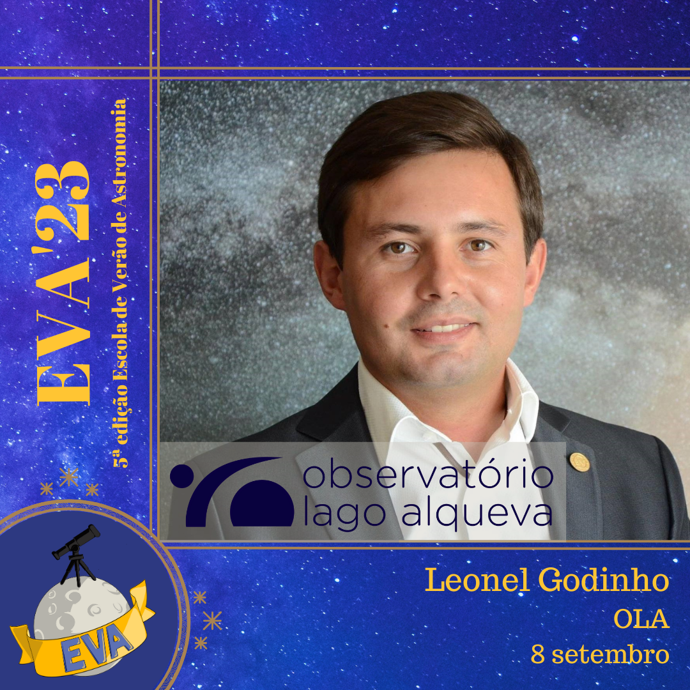

No dia 8 de setembro, a EVA23 terá a honra de receber Leonel Godinho, o Diretor do Observatório do Lago Alqueva (OLA) para uma pequena palestra enriquecedora sobre o OLA, malefícios da poluição luminosa e Astronomia.

Leonel Godinho tem um percurso diversificado e repleto de realizações notáveis. Atualmente, desempenha o papel de CEO da empresa LGR, SOCIEDADE UNIPESSOAL, LDA, um gabinete especializado em planeamento, estudos e projetos nas áreas de Urbanismo, Engenharia e Arquitetura, tanto para obras públicas como particulares. Além disso, é o líder da empresa BIOSKY, LDA, a qual detém um laboratório de acústica e o célebre OBSERVATÓRIO DO LAGO ALQUEVA - OLA (http://olagoalqueva.pt/).

Destacando-se também no setor agrícola, Leonel Godinho é responsável pela maior criação de RED WAGYU na Europa, conhecida por ser considerada a Melhor Carne do Mundo. A sua dedicação estende-se à produção de cereais e azeitonas em modo biológico e integrado.

Além das suas atividades empresariais, é uma força ativa em várias associações notáveis. Faz parte dos corpos gerentes da ALBIREO - Associação De Temáticas Da Natureza e Astronomia, da APAA - Associação Portuguesa de Astrónomos Amadores e do CCB - Centro Cultural da Barrada.

No que diz respeito à sua formação, Leonel Godinho possui uma série de certificações na área de Engenharia e Planeamento Urbanístico, destacando-se a sua Licenciatura em Engenharia Civil e Mestrado em Gestão Autárquica no ISEC.

---

### Ruben Conceição - LIP

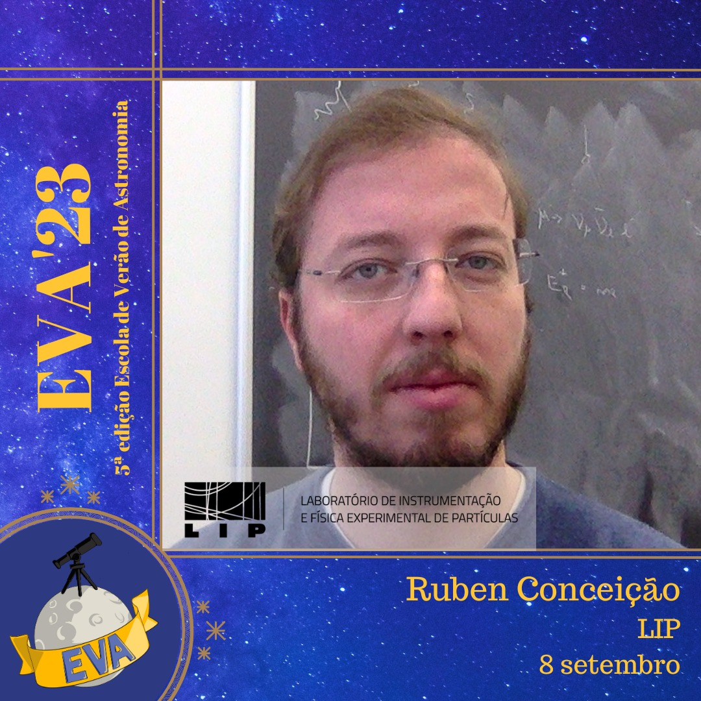

No dia 8 de setembro, a EVA23 terá o prazer de receber Ruben Conceição como representante do LIP e para uma palestra sobre Astropartículas.
Ruben Conceição doutorou-se em Física na Universidade de Lisboa, Instituto Superior Técnico, no início de 2011. Atualmente é investigador auxiliar contratado no Laboratório de Instrumentação e Física Experimental de Partículas (LIP, www.lip.pt) e Professor Assistente Convidado no departamento de física do Instituto Superior Técnico.

Enquanto investigador, desenvolve os seus trabalhos no campo da física de Astropartículas. Especializou-se no estudo das interações hadrónicas presentes nas cascatas atmosféricas induzidas pela interação de raios cósmicos de energia extrema com os átomos da atmosfera. Desde 2006 que é membro da Colaboração Pierre Auger (auger.org) - actualmente o maior observatório dedicado ao estudo de raios cósmicos. Nesta colaboração internacional é responsável pela coordenação das atividades relacionadas com a física da cascata, uma das principais estruturas de análise física da colaboração. é também o coordenador do grupo português que participa no Observatório Pierre Auger, com membros nos 3 polos do LIP: Coimbra, Lisboa e Minho.

Ruben Conceição é Co-coordenador do grupo português que participa no Southern Wide-field Gamma-ray Observatory (SWGO, swgo.org) - o observatório dedicado a raios gama de energia muito elevada a ser construído nos Andes acima dos 4400 m de altitude. Na colaboração internacional SWGO, é o coordenador do Grupo de Trabalho de Análise e Simulações, uma das principais estruturas da colaboração.

Tem mais de 100 artigos em revistas científicas de renome, escreveu uma seção de um livro sobre física de astropartículas e publicou um livro de física de partículas e astropartículas!

---

### Carla Barroso - EUMETSAT

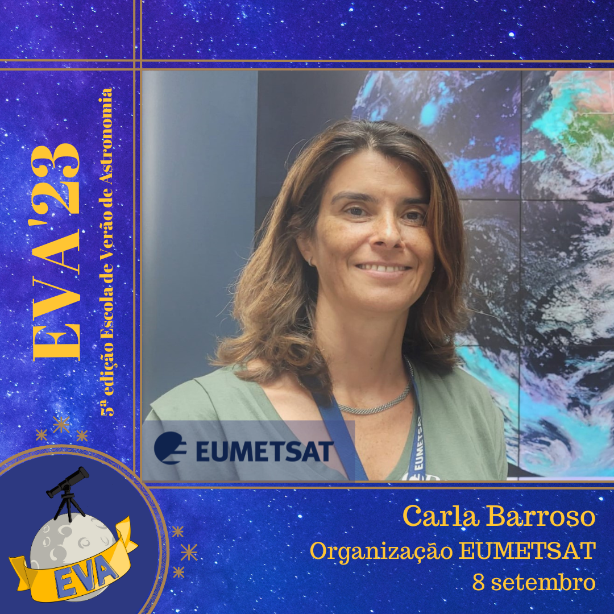

No dia 8 de setembro a EVA irá receber Carla Barroso, representante da prestigiada organização europeia EUMETSAT, para uma palestra fascinante que promete lançar luz sobre o trabalho que a EUMETSAT desenvolve, desde a sua criação em 1986, contribuindo para um sistema global de observação da Terra a partir de satélites.

---

### Breakthrough Initiatives

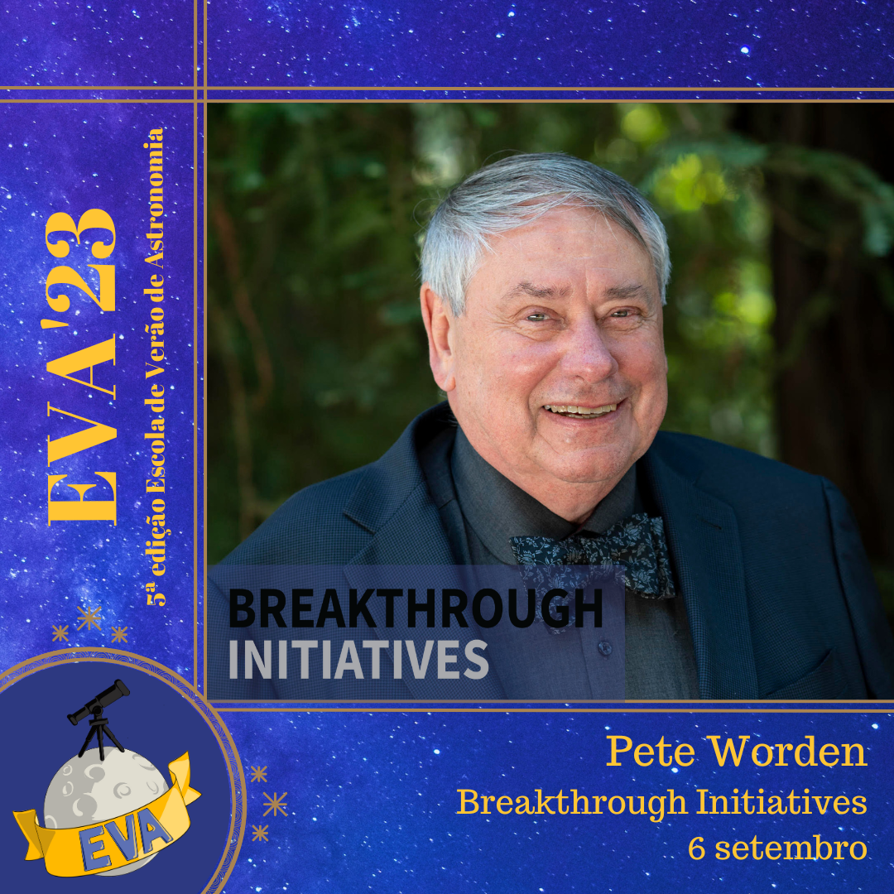

Dr. S. Pete Worden é Presidente da Fundação Breakthrough Prize, Diretor Executivo das Iniciativas Breakthrough da Fundação e especialista em exploração espacial e tecnologia. Após se reformar da Força Aérea dos Estados Unidos com o posto de General de Brigada, Pete Worden ocupou o cargo de Diretor do Centro de Pesquisa Ames da NASA de 2006 a 2015. Durante o seu mandato, desempenhou um papel de liderança no desenvolvimento de pequenos satélites e trabalhou numa ampla gama de projetos, incluindo exploração planetária, astrobiologia, computação quântica e desenvolvimento de tecnologias avançadas. No dia 6 de setembro, irá participar na EVA, onde dará uma palestra sobre as Iniciativas Breakthrough, incluindo radioastronomia, astronomia ótica e sondas interestelares. Um agradecimento especial às Iniciativas Breakthrough por tornarem esta palestra possível.

---

    

        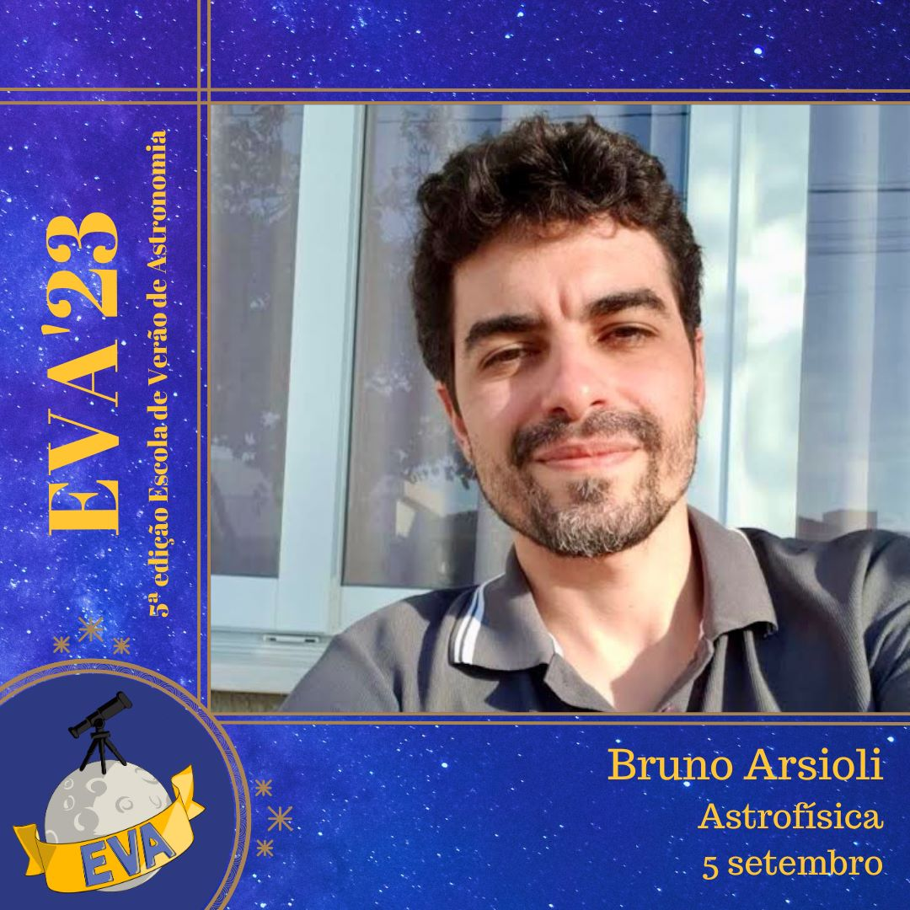
        <h3>Astrofísica</h3>
        
Bruno Arsioli é doutorado em Astrofísica na Universidade La Sapienza de Roma. O seu trabalho foca-se em Núcleos Galácticos Ativos (AGN), blazars e as suas assinaturas de multifrequência e multimensageiro. Contribuiu para a descoberta da primeira fonte extragaláctica de neutrinos astrofísicos (TXS0506 + 056); mantém colaborações contínuas com o grupo de raios gama Fermi-LAT da Universidade de Trieste, Itália; e recentemente juntou-se a grupos de trabalho para a missão Athena de raios-X. Como bolseiro Marie Curie no Instituto de Astrofísica e Ciências do Espaço em Lisboa, o seu projeto de pesquisa atual explora o uso de dados astrofísicos multifrequência, juntamente com técnicas de machine learning, para encontrar AGN-Blazars de alto desvio para o vermelho na Época da Reionização (em z ~ 7).
        

    

    

        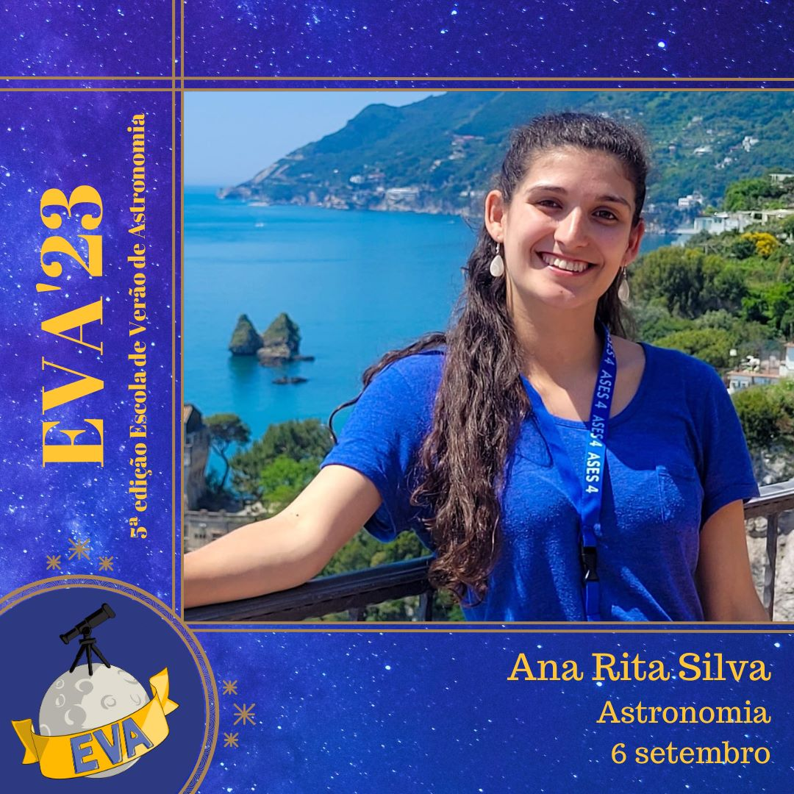
        <h3>Astronomia</h3>
        
Ana Rita Costa Silva é investigadora no IA e frequenta o Doutoramento em Astronomia na Faculdade de Ciências da Universidade do Porto, sendo a sua tese sobre o estudo de atmosferas de planetas extra-solares. Licenciada em Astrofísica em 2020 pela Universidade de Hertforshire, no Reino Unido, tem também uma grande paixão por comunicação de ciência. Participa em eventos de divulgação com o IA e partilha o dia-a-dia de uma astrónoma no Instagram (@astrophd.rita).
        

    

    

        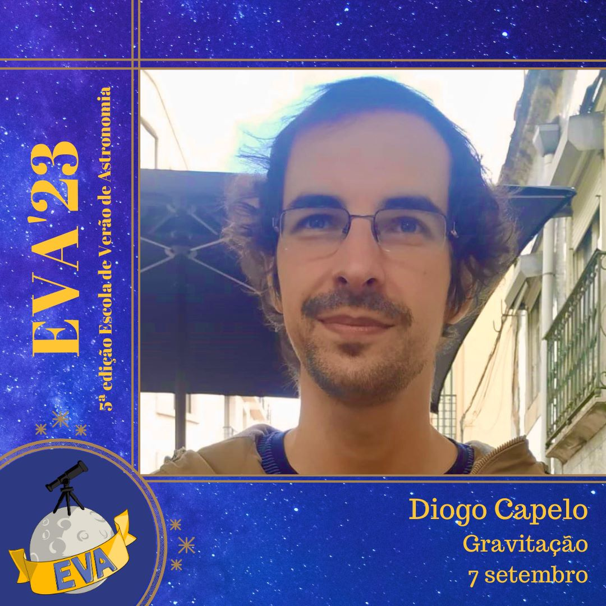
        <h3>Gravitação</h3>
        
Diogo Capelo estudou Engenharia Física no Instituto Superior Técnico, onde também faz investigação em Astrofísica teórica no grupo COSTAR do Centro de Astrofísica e Gravitação (CENTRA). Os seus interesses principais são neutrinos estelares, astrossismologia, e evolução e modelação de estrelas. Também colabora frequentemente em projetos de divulgação e ensino científicos com a TreeTree2, nomeadamente nos cursos de Física, Astrofísica e Relatividade do programa After School, e nos projetos “O LaMAA Vai à Escola”, “Programar o Futuro” e “Formigas Computacionais”. Participa na EVA desde 2021, onde tenta conciliar em 60 minutos as ideias principais da Gravitação e da mecânica clássicas.
        

    

    

        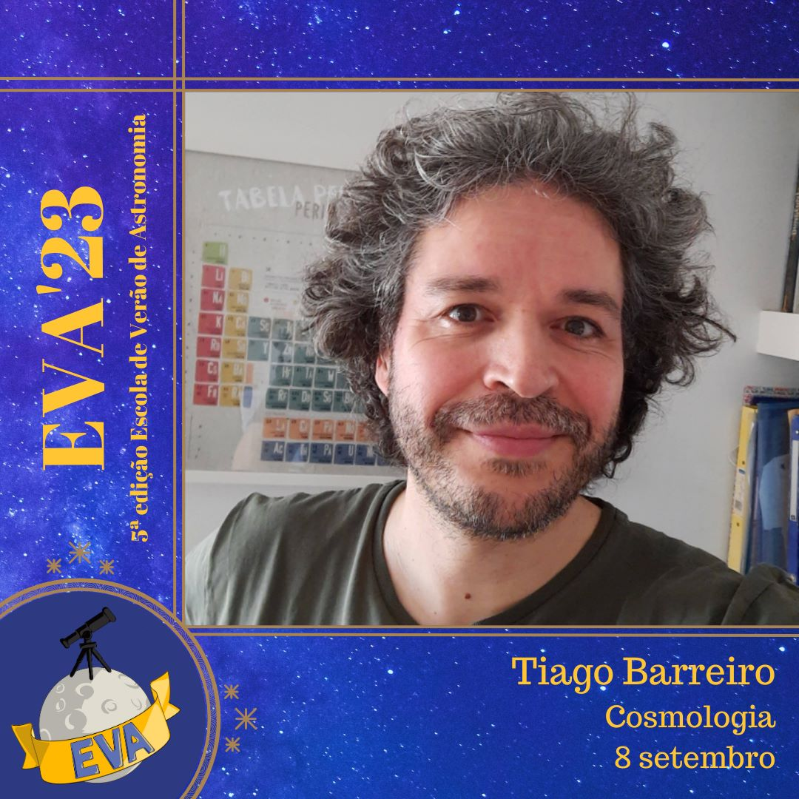
        <h3>Cosmologia</h3>
        
Tiago Barreiro é investigador no IA e professor auxiliar na Universidada Lusófona. Licenciou-se em Engenharia Física Tecnológica pela Universidade Técnica de Lisboa em 1993, tem um Mestrado pela Universidade de Sussex obtido em 1994 e completou o doutoramento pela Universidade de Sussex em 1998. É membro do IA desde 2015. Os seus interesses de investigação sempre foram em Cosmologia. Atualmente estão focados em energia escura, com destaque para modelos de quintessência com interacções com matéria escura e modelos de gravidade modificada. É membro das missões Euclid e LISA da ESA.
        

    

---

### Obrigado aos nossos Patrocinadores 🌟

---

## Diário da EVA 📖

### Dia 1 - Receção

E assim se desenrolou o primeiro dia da EVA23! Alunos de todas as partes do país reuniram-se, e nem mesmo a chuva nos impediu de viajar pela história no Observatório Astronómico de Lisboa. ✨

### Dia 2 - Astrofísica

Os alunos começaram o dia com uma palestra sobre Astrofísica com o investigador Bruno Arsioli e tiveram uma sessão de exercícios logo a seguir. Durante a tarde participaram numa Mesa Redonda sobre Buracos Negros e, por fim, realizaram um workshop de programação em Python!

### Dia 3 - Astronomia

O dia 6 de setembro começou com uma palestra incrível da Ana Rita Silva sobre Astronomia, seguida de um coffee break com os alunos da EVA23!

Os alunos tiveram a oportunidade de mergulhar nos conceitos fundamentais e até mesmo explorar o fascinante mundo dos exoplanetas! 🪐🔭🌏

Foi uma experiência enriquecedora que nos permitiu explorar conceitos de Astronomia e expandir o conhecimento sobre o Universo.

### Dia 4 - Gravitação

Começou-se o dia com uma palestra inspiradora do professor e investigador Diogo Capelo, que desmistificou e simplificou esse tema complexo para os nossos alunos.

Durante a tarde, viajou-se na história da observação do cosmos com uma Sessão de Planetário e um Workshop de Astrofotografia.

Encerrámos o dia com um toque de diversão através de uma sessão de cinema. 🎥🍿

### Dia 5 - Cosmologia

O dia começou com uma palestra envolvente dada pelo Professor Tiago Barreiro.
A seguir, tivemos o privilégio de ouvir palestras de alguns dos nossos Patrocinadores. Carla Barroso, representando a Eumetsat. Em seguida, Ruben Conceição, representando o LIP. E não poderíamos esquecer da inspiradora palestra de Leonel Godinho, diretor do Observatório do Lago Alqueva.

O dia finalizou com uma cerimónia de entrega de diplomas, um momento de celebração das conquistas e da aprendizagem de todos os alunos da EVA. Tivemos a honra de contar com a presença do Professor Pedro Amaral, representando o órgão de Presidência do IST e do Coordenador do Curso de Engenharia Física Tecnológica, o Professor Luís Melo.

E assim terminou mais uma jornada emocionante!

---

## Final da EVA23 🥲

E assim damos por terminada a Escola de Verão de Astronomia de 2023. Estamos de coração cheio!

Foi verdadeiramente inspirador testemunhar um ano de preparação árdua e dedicação concretizar-se numa semana muito especial.

Recebemos 30 alunos de todas as regiões do país, do norte ao sul, que se encontraram todos no Técnico com um objetivo em comum, explorar o incrível mundo da Astronomia e embarcar na jornada magnífica que é a EVA. Durante uma semana, os alunos tiveram a oportunidade de assistir a palestras de cientistas de renome, tanto nacionais quanto internacionais.

Durante o último ano, empenhámo-nos em obter financiamento de vários patrocinadores. Sem os nossos patrocinadores, a EVA não seria possível e por isso, estamos imensamente gratos. Devido a este apoio conseguimos mais uma vez garantir que nenhum aluno fosse impedido de participar na Escola devido a barreiras sociais ou económicas e fomos capazes de cobrir as despesas de hospedagem e refeições dos alunos, mantendo a inscrição gratuita.

Além disso, a realização da EVA contou com a incrível colaboração de cerca de 30 voluntários dedicados. Juntos, transformamos uma visão coletiva em realidade. É realmente fantástico ver todos a dar o seu contributo e tempo com paixão em prol da divulgação da Ciência.

Celebramos assim a concretização de um sonho conjunto,

**Madalena, Vasco e Dinis**

**Direção da ASTRO no mandato de 2022/2023 ✨**
