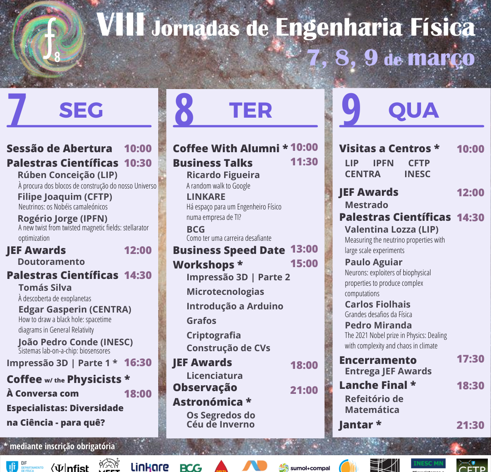

A 8ª Edição das Jornadas de Engenharia Física decorreu nos dias <u>7, 8 e 9 de março de 2022, em regime completamente presencial!</u>

Com Palestras, Workshops, "Coffee with the Physicists" e "Coffee with Alumni", oportunidades para contactar com físicos e antigos alunos, respetivamente , "Business Talks" para contactar com empresas, visitas a centros e muito mais!

---

Obrigado a todos por participarem na 8ª edição da Engenharia Física! Foram três dias onde os participantes tiveram a oportunidade de esclarecer as suas dúvidas sobre o futuro em diversas áreas de trabalho, assim como participar em workshops e outras atividades divertidas e dinâmicas!

<h2><u>Contamos convosco para a próxima edição!</u></h2>

