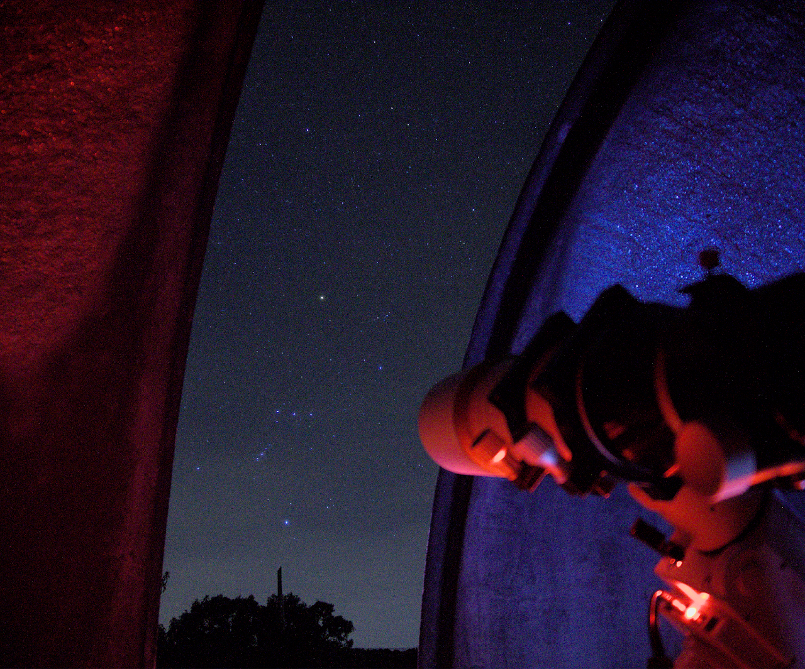
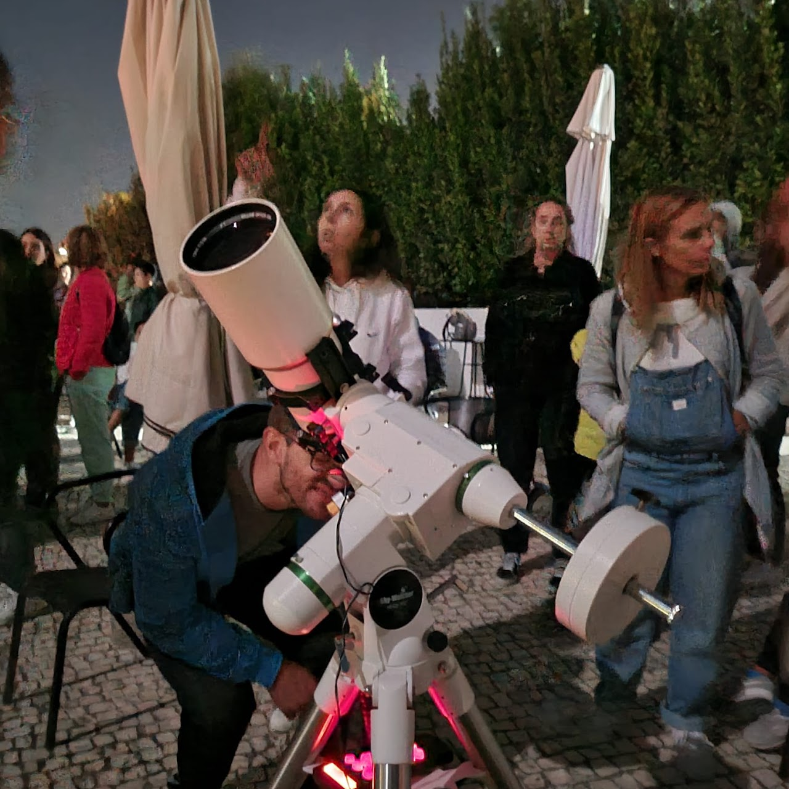
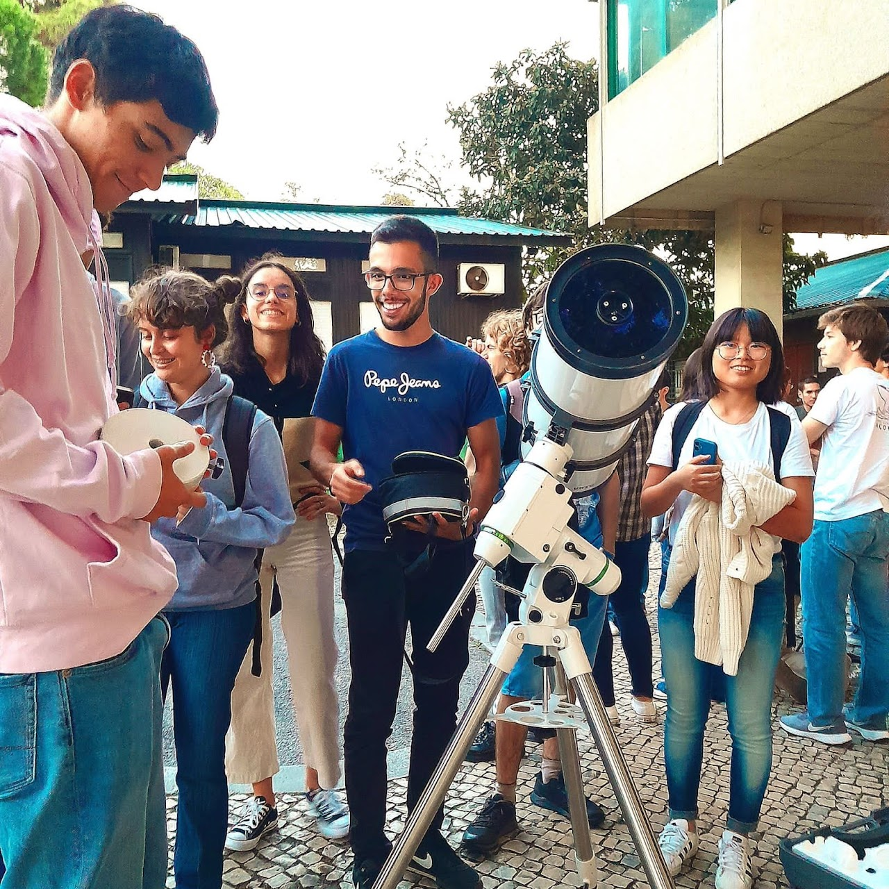
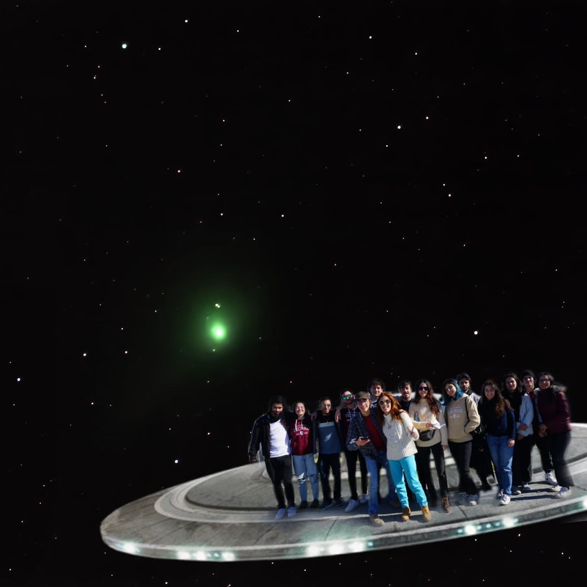
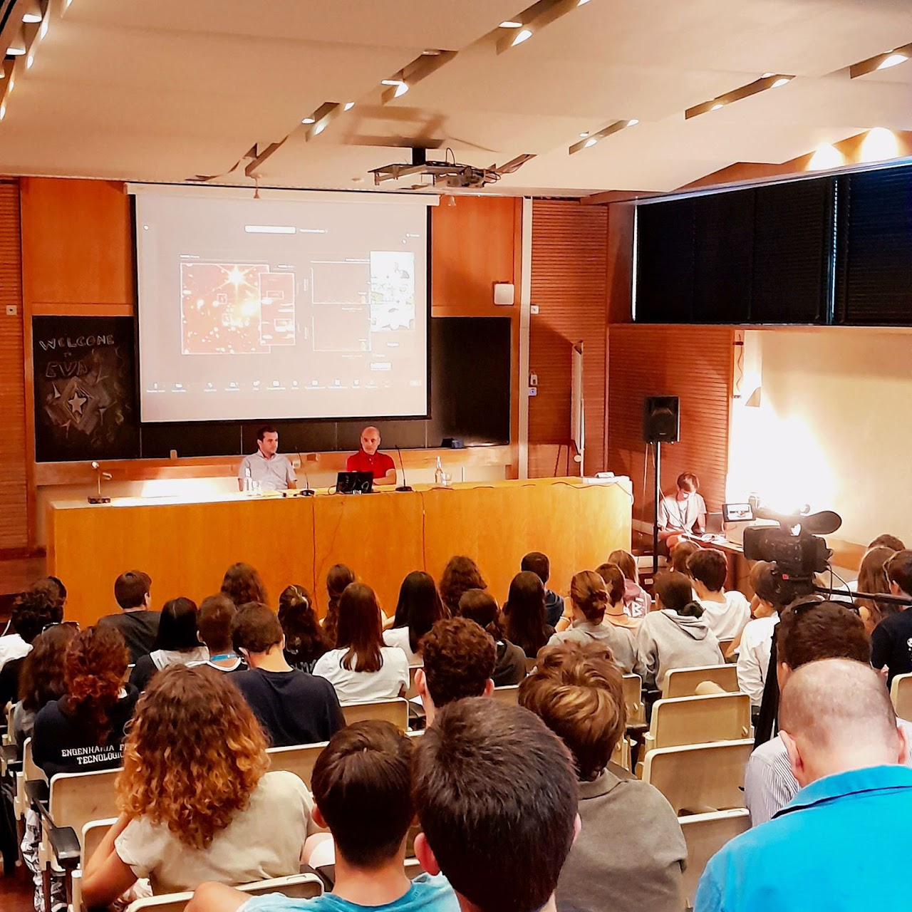
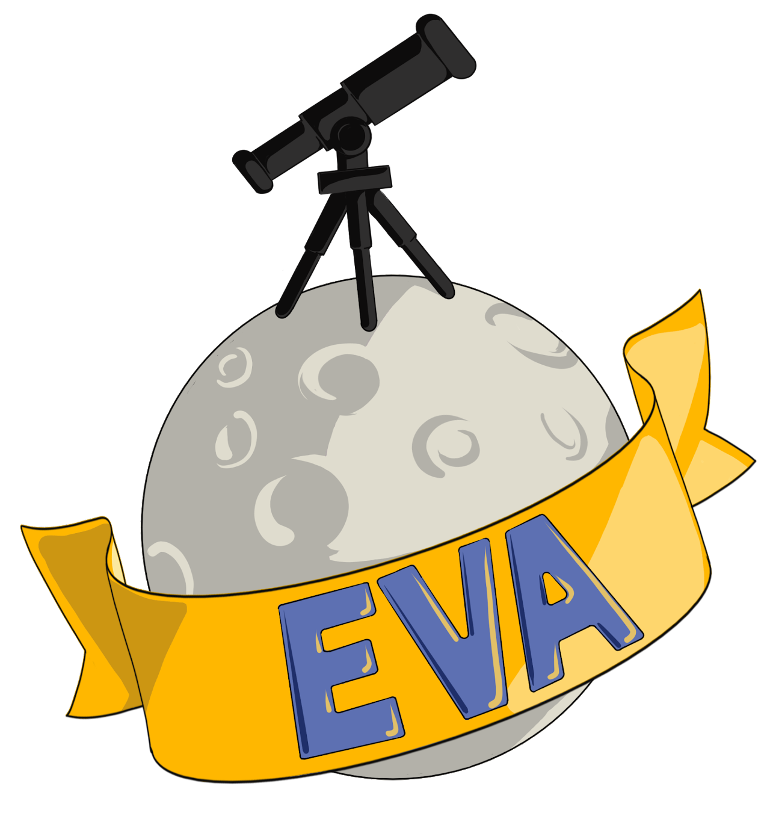

---

## Quem somos? 🧐

Desde os seus primórdios que a humanidade contempla as estrelas com fascínio e admiração. A Astronomia é, talvez, das ciências mais antigas da História, estando profundamente enraizada em várias culturas. Devido à crescente poluição luminosa nos centros urbanos, o céu estrelado deixou de fazer parte do nosso dia a dia, tornando-se a Astronomia uma ciência cada vez mais exclusiva àqueles a que ela se dedicam profissionalmente. Outros fatores, como o custo elevado de material astronómico, impedem muitos de seguir a sua paixão nesta área.

Na ASTRO, procuramos recuperar o conhecimento que os nossos antepassados guardavam do céu noturno, ensinar a utilizar telescópios e outros materiais e/ou equipamentos astronómicos e expandir o saber não só na Astronomia, mas também noutras áreas.

    

        
    

<!-- <iframe width="950" height="349" src="../pulsar01.pdf"></iframe> -->

---

## O Nosso Trabalho 🪐

As atividades da ASTRO inserem-se em duas categorias: as de <strong><u>Formação Interna</strong></u> e as de <strong><u>Formação Externa</strong></u>.

Com as atividades de Formação Interna, como as Saídas de Campo e alguns Workshops, o nosso objetivo é transmitir aos nossos colaboradores e mais recentes membros o conhecimento adquirido pelas várias gerações da ASTRO desde há quase 30 anos. Nas atividades de Formação Externa, que incluem a Escola de Verão de Astronomia (EVA), as Observações abertas ao público, alguns Workshops e muito mais, procuramos divulgar a Astronomia junto da comunidade. A ASTRO é também um espaço de convívio, que se alicerça na paixão partilhada pela Astronomia, e onde se constroem amizades e se vivem momentos inesquecíveis.

    

        <h3>Divulgação para o público</h3>
        
        <h3>Formação Interna</h3>
        
    

    

        <h3>Espaço de Convívio e Prática</h3>
        
        <h3>Escola de Verão Astronómica (EVA)</h3>
        
    

## EVA 🔭

A Escola de Verão de Astronomia é um evento que tem a duração de cinco dias destinado a alunos do Ensino Secundário, com o objetivo de promover a Astronomia, a Astrofísica, a Cosmologia e a Gravitação.

Durante a Escola realizam-se <strong><u>Palestras</strong></u>, <strong><u>Workshops</strong></u>, <strong><u>sessões de Resolução de Exercícios</strong></u>, <strong><u>Sessões de Planetário</strong></u> e <strong><u>Visitas a Centros de Ciência</strong></u>.

Mais informação <strong><u>[aqui](/eva)</strong></u>

    

        
    

---

## Mesas Redondas 🎙️

Nas Mesas Redondas que organizamos procuramos aproximar a comunidade estudantil de investigadores e professores de várias instituições, e reuni-los em torno de uma "mesa" onde se discutem tópicos relacionados com o Cosmos, como a Teoria da Relatividade Geral, as Astro-partículas e brevemente: a Astrobiologia, e outros.

`youtube:https://www.youtube.com/embed/v9n7uwlvxlM`

---

## Observações e Sessões de Planetário 🌌

Organizamos observações Solares e Observações Noturnas.

-   <strong><u>Observação solar</strong></u>: uma atividade simples e extremamente educativa sobre a Estrela do nosso Sistema Solar durante a qual, para além de poderem visualizar o Sol com todos os cuidados necessários, os participantes ficam a saber mais sobre os diferentes fenómenos que têm lugar na superfície deste astro.

-   <strong><u>Observações noturnas</strong></u>: Para ver os astros- estrelas, planetas, etc- à noite através dos nossos telescópios.

As Sessões de Planetário são realizadas no planetário da ASTRO e são adoradas pelos mais novos. Constituem uma oportunidade para observar as estrelas sem precisar de se viajar muito longe. Por vezes, são a primeira experiência de visualização de estrelas e constelações de alguns participantes que não deixam de expressar um grande “wow” quando apagamos as luzes e damos início à sessão!

Para conhecer melhor as nossas atividades, pode contactar-nos por email e consultar o nosso catálogo, que integramos neste site.

## Astrofotografia 📸

Para os interessados em Astrofotografia, algumas atividades que se realizam sob boas condições meteorológicas são acompanhadas pela prática de fotografia de objetos celestes, dos quais os membros da ASTRO se orgulham muito.

    

        
    

