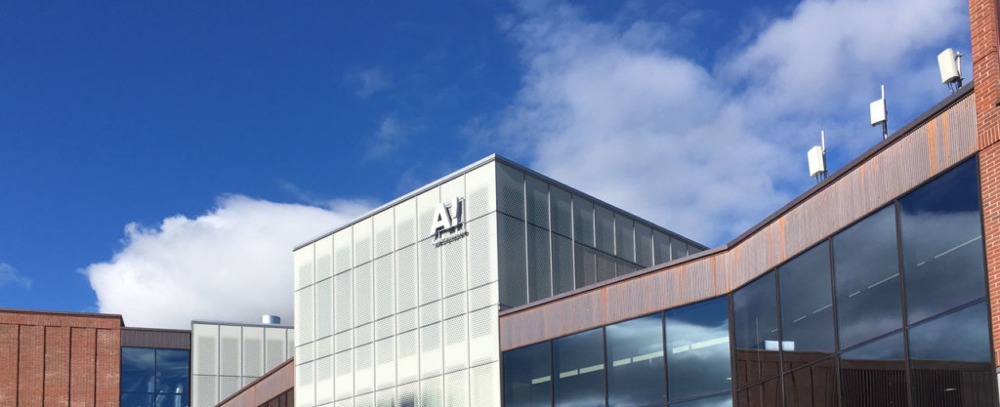

---



---

# Ensino 📚

<div style="display: flex;">
    <div style="flex-basis: 48%;">
        <h3>Aulas 👩‍🏫</h3>
        <ul>
            <li>Em Inglês</li>
        </ul>
    </div>
    <div style="flex-basis: 48%;">
        <h3>Materiais 🛠️</h3>
        <ul>
            <li>Disponibilizados na plataforma online da universidade</li>
            <li>Livros em bibliotecas</li>
        </ul>
    </div>
</div>

<div style="display: flex;">
    <div style="flex-basis: 48%;">
        <h3>Carga de trabalho 😮‍💨</h3>
        <ul>
            <li>Média</li>
        </ul>
    </div>
    <div style="flex-basis: 48%;">
        <h3>Dificuldade do Curso 🪖</h3>
        <ul>
        <li>Mais baixa que MEFT</li>
        </ul>
    </div>
</div>

<div style="display: flex;">
    <div style="flex-basis: 48%;">
        <h3>Horário ⏰</h3>
        <ul>
            <li>Escolhido pelo aluno</li>
            <li>Selecionam-se as disciplinas para que se encaixem umas nas outras 8h-16h</li>
            <li>Aulas não obrigatórias</li>
            <li>Sobreposições podem ocorrer</li>
            <li>Carga horária parecida a MEFT</li>
        </ul>
    </div>
    <div style="flex-basis: 48%;">
        <h3>Avaliação 📝</h3>
        <ul>
            <li>Testes</li>
            <li>Projetos</li>
            <li>Trabalhos</li>
            <li>Apresentações</li>
        </ul>
    </div>
</div>

<div style="display: flex;">
    <div style="flex-basis: 48%;">
        <h3>Fatores mais pessoais 🙍‍♂️</h3>
        <ul>
            <li>A universidade disponibiliza
                <ul>
                    <li>salas de estudo, confortáveis</li>
                    <li>laboratórios</li>
                    <li>oficinas</li>
                    <li>material
                        <ul>
                            <li>computadores</li>
                            <li>ecrãs para ligar ao computador</li>
                        </ul>
                    </li>
                </ul>
            </li>
            <li>muito boas condições</li>
            <li>espaços de estudo sempre disponíveis</li>
            <li>o acesso aos professores é mais facilitado</li>
            <li>serviços académicos da universidade são muito bons</li>
        </ul>
    </div>
    <div style="flex-basis: 48%;">
        <h3>Opções Extra 🏅</h3>
        <ul>
            <li>Atividades extra-curriculares:</li>
            <li>Eventos para estudantes organizados pela faculdade
                <ul>
                    <li>Festas</li>
                    <li>Saunas</li>
                    <li>Exposições de arte</li>
                </ul>
            </li>
            <li>Disponibiliza desportos e ginásio.</li>
        </ul>
    </div>
</div>

### Equivalências 📜

<div style="display: flex;">
    <div style="flex-basis: 48%;">
        <h4>1º Semestre ❄️ </h4>
        <ul>
            <li>Física e Tecnologia dos Plasmas;</li>
            <li>Nanotecnologias;</li>
            <li>Complementos de Mecânica Quântica;</li>
            <li>Ótica e Lasers;</li>
            <li>Opção Livre.</li>
        </ul>
    </div>
    <div style="flex-basis: 48%;">
        <h4>2º Semestre ☀️ </h4>
        <ul>
            <li>Complementos de Mecânica Quântica;</li>
            <li>Física da Matéria Condensada;</li>
            <li>Física e Tecnologia dos Plasmas;</li>
            <li>2 opções livres.</li>
        </ul>
    </div>
</div>

---

# Qualidade de Vida ❤️

<div style="display: flex;">
    <div style="flex-basis: 48%;">
        <h3>Alojamento 🏡</h3>
        <ul>
            <li>Não é difícil de encontrar (websites sugeridos pela universidade)</li>
            <li>Preço de alojamento é bastante alto :
                <ul>
                    <li>um quarto ronda os 500-700€/mês</li>
                    <li>o alojamento para estudante com condições razoáveis: 430€/mês.</li>
                    <li>longe do centro da cidade e do campus em Espoo encontras opções mais baratas: 350-400€/mês.</li>
                </ul>
            </li>
        </ul>
    </div>
    <div style="flex-basis: 48%;">
        <h3>Transportes 🚌</h3>
        <ul>
            <li>A rede de transportes de Helsínquia é muito boa</li>
            <li>Facilidade em deslocar-se dentro e para fora da cidade/país tendo uma relação qualidade/preço igualmente excelente</li>
            <li>Preço de passes únicos parecidos aos praticados em Lisboa (metro, comboio, eléctrico, autocarro e ferry tudo incluído: 32.80Eur/mês)</li>
            <li>Relação qualidade/preço é muito superior à de Lisboa</li>
        </ul>
    </div>
</div>

---

# Quotes 🎙️

```
Vão a todos os eventos que conseguirem.
Se o fizerem, estão a poucos passos de ter o melhor semestre/ano das vossas vidas.
```

---

# Informação Extra ➕

O aluno que frequentou esta universidade teve direito a bolsa de estudo que cobriu parcialmente as despesas. A bolsa não foi entregue dentro do tempo previsto tendo chegado 2 meses atrasada.

Os produtos básicos apresentam uma relação qualidade/preço razoável e são fáceis de encontrar.

Apesar de as pessoas aparentarem ser frias, mostraram-se amáveis! A cidade é muito segura, mesmo em zonas mais periféricas e menos frequentadas onde normalmente se encontram as residências de estudantes.
