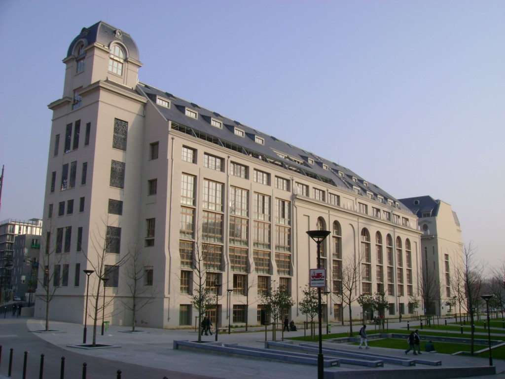

---

---

# Ensino 📚

    

        <h3>Aulas 👩‍🏫</h3>
        <ul>
            <li>Principalmente em Francês</li>
            <li>Existem algumas do 2º Ano de Mestrado em Inglês</li>
        </ul>
    

    

        <h3>Materiais 🛠️</h3>
        <ul>
            <li>Disponibilizados na plataforma online da universidade</li>
            <li>Livros em bibliotecas</li>
        </ul>
    

    

        <h3>Fatores mais pessoais 🙍‍♂️</h3>
        <ul>
            <li>Qualidade do ensino é semelhante a em MEFT</li>
            <li>Os professores são disponíveis e próximos</li>
            <li>Os serviços académicos da universidade são aceitáveis</li>
            <li>Há muitos lugares para estudar de excelente qualidade</li>
            <li>A faculdade tem uma boa especialização no 2º Ano do mestrado em dispositivos quânticos e nanotecnologia.</li>
        </ul>
    

    

        <h3>Avaliação 📝</h3>
        <ul>
            <li>Testes</li>
            <li>Trabalhos de casa</li>
            <li>Provas orais</li>
        </ul>
    

    

        <h3>Carga de trabalho 😮‍💨</h3>
        <ul>
            <li>Inferior a MEFT</li>
        </ul>
    

    

        <h3>Opções Extra 🏅</h3>
        <ul>
            <li>Atividades extra-curriculares</li>
        </ul>
    

### Equivalências 📜

    

        <h4>1º Semestre ❄️</h4>
        <ul>
            <li>Física do Estado Sólido;</li>
            <li>Astrofísica;</li>
            <li>Física Nuclear;</li>
            <li>Física de Partículas;</li>
            <li>Opções Livres.</li>
        </ul>
    

---

# Qualidade de Vida ❤️

    

        <h3>Alojamento 🏡</h3>
        <ul>
            <li>Muito difícil de arranjar (anúncios online)</li>
            <li>Preços:
                <ul>
                    <li>quarto alugado : cerca de 600 EUR/mês</li>
                    <li>residência de estudantes: ~700 EUR/mês</li>
                    <li>é possível obter ~90 EUR de complemento ao alojamento</li>
                </ul>
            </li>
            <li>O alojamento é de muito boa qualidade</li>
        </ul>
    

    

        <h3>Transportes 🚌</h3>
        <ul>
            <li>Os transportes são bons,</li>
            <li>ótima relação preço/qualidade</li>
            <li>fácil arranjar transporte para fora da cidade/do país, a preços semelhantes aos Portugueses</li>
        </ul>
    

---

# Informação Extra ➕

A bolsa que a aluna recebeu foi só para um semestre, e chegou dentro do previsto, mas não foi de todo suficiente para cobrir os custos da estadia.
A cidade é bastante segura e os parisienses são hospitáveis!
