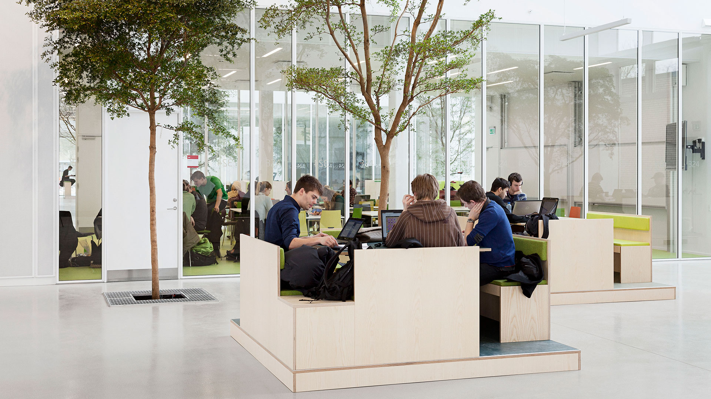

---



---

# Ensino 📚

<div style="display: flex;">
    <div style="flex-basis: 48%;">
        <h3>Aulas 👩‍🏫</h3>
        <ul>
            <li>Em inglês</li>
            <li>Os alunos e os professores falam entre si em inglês, visto que muitos dos alunos de mestrado são internacionais, assim como os professores.</li>
        </ul>
    </div>
    <div style="flex-basis: 48%;">
        <h3>Materiais 🛠️</h3>
        <ul>
            <li>Universidade dá acesso a diversos meios, incluindo:</li>
            <ul>
                <li>Papers</li>
                <li>Livros</li>
            </u>
            <li>(removendo a necessidade de comprar material de estudo)</li>
        </ul>
    </div>
</div>

<div style="display: flex;">
    <div style="flex-basis: 48%;">
        <h3>Fatores mais pessoais 🙍‍♂️</h3>
        <ul>
            <li>Salas de estudo para cada curso com boas condições</li>
            <li>As cadeiras dão bastante trabalho, tendo em conta os créditos que valem</li>
            <li>Ensino bastante bom</li>
            <li>Os professores são muito próximos para responder a qualquer dúvida, ou questão.</li>
            <li>Existe também a possibilidade de se fazer cadeiras mais transversais e interdisciplinares na <a href="https://www.unil.ch/index.html">UNIL</a>, que valem mais créditos</li>
            <li>Os serviços administrativos são muito bons.</li>
            <li>Os alunos sentem que conseguem chegar a um nível de excelência bastante elevado, tendo alguma liberdade na dedicação que dão à universidade.</li>
        </ul>
    </div>
    <div style="flex-basis: 48%;">
        <h3>Carga de trabalho 😮‍💨</h3>
        <ul>
            <li>Inferior a MEFT</li>
        </ul>
        <h3>Dificuldade do Curso 🪖</h3>
        <ul>
            <li>Inferior a MEFT</li>
        </ul>
    </div>
</div>

<div style="display: flex;">
    <div style="flex-basis: 48%;">
        <h3>Horário ⏰</h3>
        <ul>
            <li>Predefinido para cada cadeira</li>
            <li>Não há liberdade de escolha uma vez escolhidas as cadeiras.</li>
            <li>As cadeiras dividem-se entre as vagas que definem o horário em que estas vão ser lecionadas, assim como o dia do exame final</li>
            <li>Pode-se escolher entre um horário da manhã e um horário da tarde.</li>
            <li>Carga horária: inferior a MEFT</li>
        </ul>
    </div>
    <div style="flex-basis: 48%;">
        <h3>Avaliação 📝</h3>
        <ul>
            <li>Componente de trabalho continuo (apresentações, TPC's, quizzes, etc.)</li>
            <li>Componente de exame final, que normalmente consiste numa prova oral ou um projeto final</li>
            <li>Os métodos de avaliação são publicados antes do ano letivo começar nas paginas da cadeira.</li>
        </ul>
    </div>
</div>

### Equivalências 📜

#### 1º Semestre ❄️

-   Física e Tecnologia dos Plasmas;
-   Nanotecnologias e Nanoeletrónica;
-   Tecnologias Energéticas;
-   Técnicas de Micro e Nanofabricação;

---

# Qualidade de Vida ❤️

<div style="display: flex;">
    <div style="flex-basis: 48%;">
        <h3>Transportes 🚌</h3>
        <ul>
            <li>Forma base de transporte: bicicleta</li>
            <li>Transportes de longo curso: comboio.</li>
        </ul>
    </div>
    <div style="flex-basis: 48%;">
        <h3>Atividades Extra 🏅</h3>
        <ul>
            <li>A DTU possui uma organização, a Carbon, que cria vários eventos sociais para os alunos:</li>
            <ul>
                <li>watch parties</li>
                <li>visitas a museus</li>
                <li>(...)</li>
            </ul>
            <li>Organiza também uma Introduction week, como forma de integração inicial</li>
        </ul>
    </div>
</div>

---

# Quotes 🎙️

```
Decidi ir estudar para fora como uma forma de ter uma perspetiva diferente do sistema
universitário e cultural em Portugal.
```
