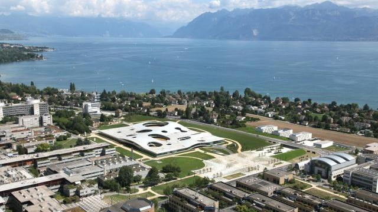

---



---

# Ensino 📚

<div style="display: flex;">
    <div style="flex-basis: 48%;">
        <h3>Aulas 👩‍🏫</h3>
        <ul>
            <li>Em Inglês</li>
        </ul>
    </div>
    <div style="flex-basis: 48%;">
        <h3>Materiais 🛠️</h3>
        <ul>
            <li>Moodle com todo o material disponibilizado</li>
        </ul>
    </div>
</div>

<div style="display: flex;">
    <div style="flex-basis: 48%;">
        <h3>Fatores mais pessoais 🙍‍♂️</h3>
        <ul>
            <li>Salas de estudo para cada curso com boas condições</li>
            <li>As cadeiras dão bastante trabalho, tendo em conta os créditos que valem</li>
            <li>Ensino bastante bom</li>
            <li>Os professores são muito próximos para responder a qualquer dúvida, ou questão.</li>
            <li>Existe também a possibilidade de se fazer cadeiras mais transversais e interdisciplinares na UNIL, que valem mais créditos</li>
            <li>Os serviços administrativos são muito bons.</li>
        </ul>
    </div>
    <div style="flex-basis: 48%;">
        <h3>Carga de trabalho 😮‍💨</h3>
        <ul>
            <li>Leve</li>
        </ul>
        <h3>Dificuldade do Curso 🪖</h3>
        <ul>
            <li>Elevada</li>
        </ul>
    </div>
</div>

<div style="display: flex;">
    <div style="flex-basis: 48%;">
        <h3>Horário ⏰</h3>
        <ul>
            <li>Escolhido pelo aluno</li>
        </ul>
    </div>
    <div style="flex-basis: 48%;">
        <h3>Avaliação 📝</h3>
        <ul>
            <li>Difere de cadeira para cadeira</li>
            <li>Pode ser através de:</li>
            <ul>
                <li>Exame escrito</li>
                <li>Prova oral</li>
                <li>Avaliação contínua,</li>
                <li>(...)</li>
            </ul>
            <li>Cada pessoa escolhe o que quer, sendo aconselhado ter de todas, para não acumular as avaliações todas na mesma altura.</li>
        </ul>
    </div>
</div>

### Equivalências 📜

#### 1º Semestre ❄️

-   Técnicas de Micro e Nanofabricação;
-   Tecnologia Nuclear e de Física de Partículas;
-   Opcionais livres.

---

# Qualidade de Vida ❤️

<div style="display: flex;">
    <div style="flex-basis: 48%;">
        <h3>Alojamento 🏡</h3>
        <ul>
            <li>Razoavelmente boas</li>
            <li>Por volta dos 800-900€/mês</li>
        </ul>
    </div>
    <div style="flex-basis: 48%;">
        <h3>Transportes 🚌</h3>
        <ul>
            <li>Dentro da cidade:</li>
            <ul>
                <li>Aceitáveis</li>
                <li>Não muito caros</li>
            </ul>
            <li>Fora da cidade:</li>
            <ul>
                <li>Boa relação qualidade/preço.</li>
            </ul>
        </ul>
    </div>
</div>

---

# Quotes 🎙️

```
Abre a mentalidade, aprende-se a viver sozinho e a vivenciar diferentes formas de
ver o mundo. Novas culturas, novos amigos, novas histórias. Aprende-se o que é vida
e física além do tecnico.
```

---

# Informação Extra ➕

Os alunos que frequentaram esta faculdade tiveram bolsa de estudo, mas disseram que esta não chegou para as despesas necessárias.
A cidade é bastante segura!
