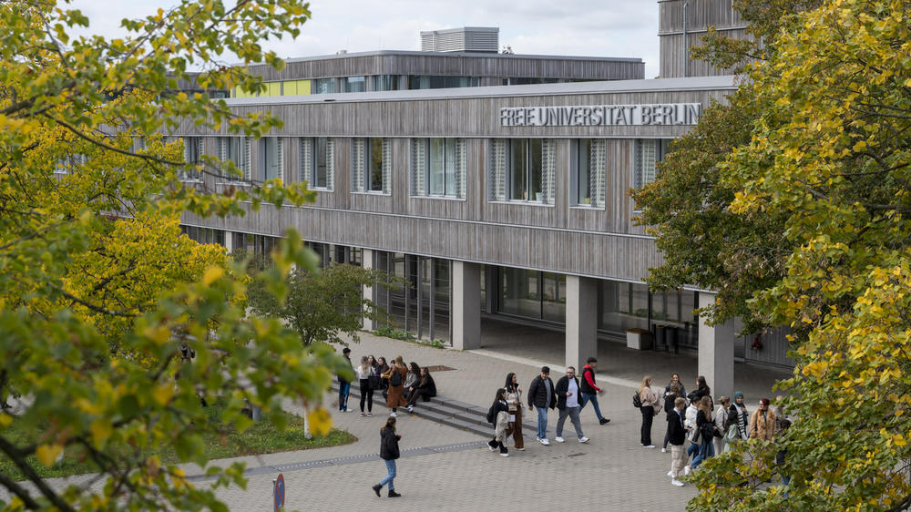

---



---

# Ensino 📚

<u>Foco:</u> Nenhuma área específica

<div style="display: flex;">
    <div style="flex-basis: 48%;">
        <h3>Aulas 👩‍🏫</h3>
        <ul>
            <li>Inglês</li>
        </ul>
    </div>
    <div style="flex-basis: 48%;">
        <h3>Materiais 🛠️</h3>
        <ul>
            <li>Estudar a partir dos apontamentos das aulas é suficiente</li>
        </ul>
    </div>
</div>

<div style="display: flex;">
    <div style="flex-basis: 48%;">
        <h3>Fatores mais pessoais 🙍‍♂️</h3>
        <ul>
            <li>Qualidade de ensino média/boa</li>
            <li>Professores disponíveis e prontos para ajudar</li>
            <li>Ótima qualidade serviços académicos</li>
        </ul>
    </div>
    <div style="flex-basis: 48%;">
        <h3>Carga de trabalho 😮‍💨</h3>
        <ul>
            <li>Baixa</li>
        </ul>
        <h3>Dificuldade do Curso 🪖</h3>
        <ul>
            <li>Baixa</li>
        </ul>
    </div>
</div>

<div style="display: flex;">
    <div style="flex-basis: 48%;">
        <h3>Horário ⏰</h3>
        <ul>
            <li>Feito pelos serviços académicos</li>
            <li>Carga horária baixa</li>
            <li>1-2 aulas/semana para cada cadeira</li>
        </ul>
    </div>
    <div style="flex-basis: 48%;">
        <h3>Avaliação 📝</h3>
        <ul>
            <li>Apresentações</li>
            <li>Provas orais</li>
            <li>Dependem das cadeiras</li>
        </ul>
    </div>
</div>

### Equivalências 📜

<div style="display: flex;">
    <div style="flex-basis: 48%;">
        <h4>1º Semestre ❄️ </h4>
        <ul>
            <li>Introdução à Investigação;</li>
            <li>Astrofísica;</li>
            <li>Laboratório de Astrofísica;</li>
            <li>Nanotecnologias;</li>
            <li>Complementos de Mecância Quântica;</li>
            <li>Opção Livre.</li>
        </ul>
    </div>
    <div style="flex-basis: 48%;">
        <h4>2º Semestre ☀️ </h4>
        <ul>
            <li>Introdução à Investigação;</li>
            <li>Técnicas de Micro e Nanofabricação;</li>
            <li>Sistemas Dinâmicos;</li>
            <li>Opções Livres.</li>
        </ul>
    </div>
</div>

---

# Qualidade de Vida ❤️

<div style="display: flex;">
    <div style="flex-basis: 48%;">
        <h3>Alojamento 🏡</h3>
        <ul>
            <li><b>Opções:</b></li>
            <li>Não é difícil arranjar</li>
            <li>Residência de estudantes: por volta de 380€/mês</li>
            <li>Quarto ou apartamento em Berlim: por volta de 600€/mês</li>
            <li>Sugestão: contactem com estudantes que já tenham ido para facilitar o processo</li>
        </ul>
    </div>
    <div style="flex-basis: 48%;">
        <h3>Transportes 🚌</h3>
        <ul>
            <li>Boa qualidade</li>
            <li>Gratuitos para estudantes</li>
            <li>Facilita a deslocação dentro e para fora da cidade</li>
        </ul>
    </div>
</div>

---

# Quotes 🎙️

```
Acho que é uma oportunidade para enfrentar desafios que só se têm ao viver sozinho
num país distante do nosso
```

```
É uma boa oportunidade para conhecer novas áreas de física, outros métodos de
ensino e viver num país diferente.
```

---

# Informação Extra ➕

A bolsa que a aluna recebeu foi só para um semestre, e chegou dentro do previsto, mas apenas cobriu parcialmente os custos da estadia.
A cidade é segura e as pessoas são simpáticas!
