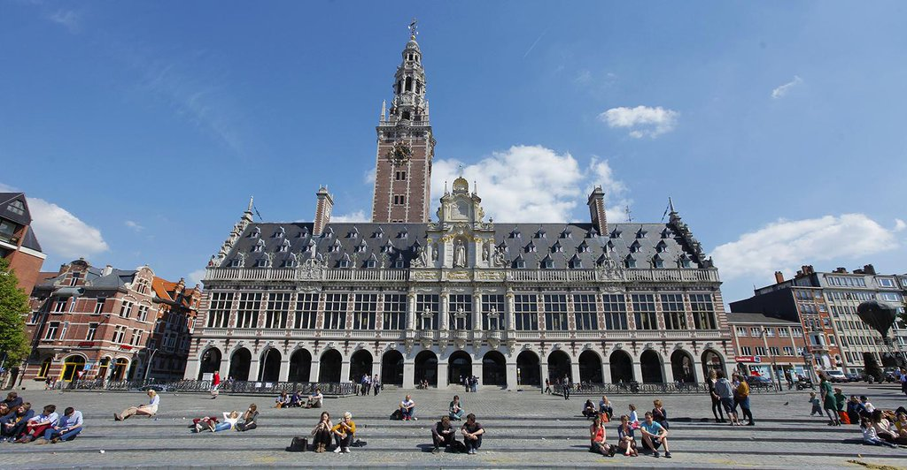

---

# Ensino 📚

<div style="display: flex;">
    <div style="flex-basis: 48%;">
        <h3>Aulas 👩‍🏫</h3>
        <ul>
            <li>Inglês</li>
        </ul>
    </div>
    <div style="flex-basis: 48%;">
        <h3>Materiais 📚</h3>
        <ul>
            <li>Estudar a partir dos apontamentos das aulas é suficiente</li>
        </ul>
    </div>
</div>

<div style="display: flex;">
    <div style="flex-basis: 48%;">
        <h3>Fatores mais pessoais 🙍‍♂️</h3>
        <ul>
            <li>Qualidade de ensino média/boa</li>
            <li>Professores disponíveis e prontos para ajudar</li>
            <li>Ótima qualidade serviços académicos</li>
        </ul>
    </div>
    <div style="flex-basis: 48%;">
        <h3>Carga de trabalho ⏰</h3>
        <p>Mais que em MEFT</p>
    </div>
</div>

<div style="display: flex;">
    <div style="flex-basis: 48%;">
        <h3>Dificuldade do Curso 🪖</h3>
        <p>Média</p>
    </div>
    <div style="flex-basis: 48%;">
        <h3>Horário ⏰</h3>
        <ul>
            <li>Só de manhã</li>
            <li>Carga horária baixa</li>
            <li>Opções de horários para cadeiras muito limitadas</li>
        </ul>
    </div>
</div>

### Avaliação 🧐

-   Em inglês
-   Teste oral + teste escrito
-   Método contínuo
-   Entregar fichas semanalmente ou bisemanalmente

### Equivalências 📜

#### 1º Semestre

-   Relatividade e cosmologia;
-   Complementos de Mecânica Quântica;
-   Física e tecnologias dos Plasmas;
-   Astrofísica;
-   Nanotecnologias e Nanoelectrónica.

---

# Qualidade de Vida ❤️

<div style="display: flex;">
    <div style="flex-basis: 48%;">
        <h3>Alojamento 🏡</h3>
        <ul>
            <li>Candidatura a residências através do site da faculdade</li>
            <li>Vagas para as residências costumam ficar ocupadas muito rapidamente por volta de 300-500€/mês</li>
            <li><u>Sugestão</u>: inscrição no site de KULeuven que permite uma procura mais simples e mais prática do alojamento pretendido (Kotwijs)</li>
        </ul>
    </div>
    <div style="flex-basis: 48%;">
        <h3>Transportes 🚌</h3>
        <ul>
            <li>Ótimos dentro da cidade</li>
            <li>Passe de autocarro, transporte mais comum, custa 25 €/ano</li>
            <li>Comum usar bicicleta como meio de transporte dentro da cidade pelo que os preços de aluguer e compra das mesmas não excede o preço dos transportes públicos</li>
        </ul>
    </div>
</div>

---

# Quotes 🎙️

```
Ao estudar fora estão a:
#1: Sair do técnico durante algum tempo, ter profs novos (mais competentes e empenhados
de muito longe);
#2: Conhecer pessoas de países diferentes, culturas diferentes e possivelmente
ganhar uma mini rede de amigos espalhada pelo mundo;
#3: Viver completamente fora do país durante algum tempo vai-vos fazer ver a
vossa possível carreira de uma maneira completamente diferente
```
