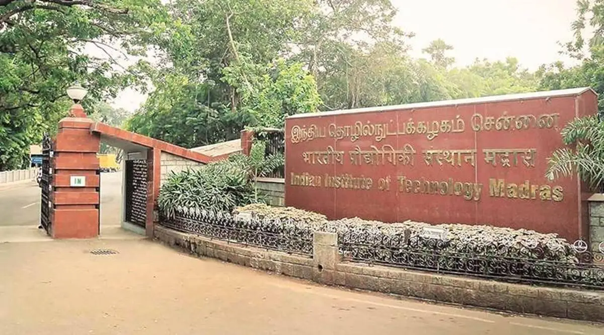

---



---

# Ensino 📚

<u>Foco:</u> Engenharia

<div style="display: flex;">
    <div style="flex-basis: 48%;">
        <h3>Aulas 👩‍🏫</h3>
        <ul>
            <li>Em Inglês</li>
        </ul>
    </div>
    <div style="flex-basis: 48%;">
        <h3>Materiais 🛠️</h3>
        <ul>
            <li>Livros em bibliotecas</li>
        </ul>
    </div>
</div>

<div style="display: flex;">
    <div style="flex-basis: 48%;">
        <h3>Fatores mais pessoais 🙍‍♂️</h3>
        <ul>
            <li>Qualidade de ensino boa</li>
            <li>Qualidade dos serviços académicos intermédia</li>
            <li>Há bastantes sítios para estudar.</li>
        </ul>
    </div>
    <div style="flex-basis: 48%;">
        <h3>Carga de trabalho 😮‍💨</h3>
        <ul>
            <p>Baixa</p>
        </ul>
    </div>
</div>

<div style="display: flex;">
    <div style="flex-basis: 48%;">
        <h3>Dificuldade do Curso 🪖</h3>
        <ul>
            <li>Baixa</li>
        </ul>
    </div>
    <div style="flex-basis: 48%;">
        <h3>Horário ⏰</h3>
        <li>Feito pelo aluno</li>
    </div>
</div>

<div style="display: flex;">
    <div style="flex-basis: 48%;">
        <h3>Avaliação 🧐</h3>
        <ul>
            <li>testes</li>
            <li>apresentações</li>
            <li>trabalhos</li>
        </ul>
    </div>
    <div style="flex-basis: 48%;">
        <h3>Opções Extra 🏅</h3>
        <ul>
            <li>A universidade permite a prática de atividades extra-curriculares</li>
        </ul>
    </div>
</div>

<div style="display: flex;">
    <div style="flex-basis: 48%;">
        <h3>Equivalências 📜</h3>
        <h4>1º Semestre ❄️</h4>
        <ul>
            <li>Física de Partículas;</li>
            <li>Nanotecnologias;</li>
            <li>Complementos de Mecânica Quântica;</li>
            <li>Ótica e Lasers;</li>
            <li>Métodos de Caracterização em FES</li>
        </ul>
    </div>
</div>

---

# Qualidade de Vida ❤️

<div style="display: flex;">
    <div style="flex-basis: 48%;">
        <h3>Alojamento 🏡</h3>
        <ul>
            <li>Fácil de arranjar na residência da universidade dentro do campus:</li>
            <li>Custo 200€/semestre</li>
            <li>Boa qualidade</li>
        </ul>
    </div>
    <div style="flex-basis: 48%;">
        <h3>Transportes 🚌</h3>
        <ul>
            <li>Relação preço-qualidade muito boa</li>
            <li>Muito baratos, dentro e para fora da cidade.</li>
        </ul>
    </div>
</div>

---

# Quotes 🎙️

```
É uma oportunidade muito boa para viajar e conhecer outras culturas, e ganhar mais
independência e autonomia.
```

```
Estar a viver lá durante aqueles meses foi uma experiência verdadeiramente única.
```

```
Se estiveres à procura de uma mobilidade que dê para conciliar estudos com viagens,
com uma boa dose de aventura, e tiveres aquele friozinho no estômago quando pensas na
possibilidade de ir para um sítio completamente diferente daquilo a que estás
habituado, então a Índia é sem dúvida um dos melhores sítios para se ir.
```
