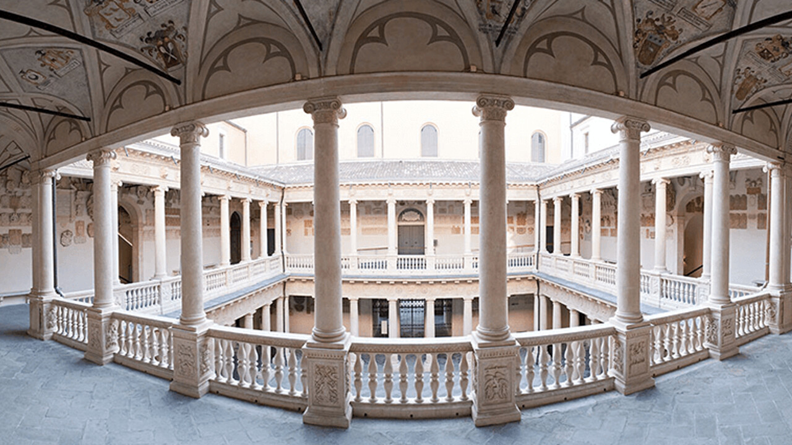

---



---

# Ensino 📚

<u>Foco:</u> Física das altas energias

<div style="display: flex;">
        <div style="flex-basis: 48%;">
            <h3>Aulas 👩‍🏫</h3>
            <ul>
                <li>Em Inglês</li>
            </ul>
        </div>
        <div style="flex-basis: 48%;">
            <h3>Materiais 🛠️</h3>
            <ul>
                <li>Disponibilizados na plataforma online da universidade</li>
                <li>Livros em bibliotecas</li>
            </ul>
        </div>
</div>

<div style="display: flex;">
        <div style="flex-basis: 48%;">
            <h3>Fatores mais pessoais 🙍‍♂️</h3>
            <ul>
                <li>O ensino é bom</li>
                <li>Os professores mostram-se muito disponíveis e prontos para ajudar.</li>
            </ul>
        </div>
</div>
<div style="display: flex;">
    <div style="flex-basis: 48%;">
        <h3>Carga de trabalho 😮‍💨</h3>
        <ul>
            <li>Baixa</li>
        </ul>
    </div>
    <div style="flex-basis: 48%;">
        <h3>Dificuldade do Curso 🪖</h3>
        <ul>
            <li>Média</li>
        </ul>
    </div>
</div>

<div style="display: flex;">
    <div style="flex-basis: 48%;">
        <h3>Horário ⏰</h3>
        <ul>
            <li>Consoante as cadeiras escolhidas</li>
            <li>Sobreposições podem ocorrer</li>
        </ul>
    </div>
    <div style="flex-basis: 48%;">
        <h3>Avaliação 📝</h3>
        <ul>
            <li>provas orais</li>
        </ul>
    </div>
</div>

### Opções Extra 🏅

-   Como a carga de trabalho não é muito exigente, permite que se tenha tempo para atividades extra curriculares.

### Equivalências 📜

#### 2º Semestre ☀️

-   Introdução à Investigação;
-   Eletrónica;
-   Física da Matéria Condensada;
-   Opções Livres.

---

# Qualidade de Vida ❤️

<div style="display: flex;">
    <div style="flex-basis: 48%;">
        <h3>Alojamento 🏡</h3>
        <ul>
            <li>Fácil de arranjar</li>
            <li>Preço quarto alugado num apartamento: 400-450€/mês.</li>
            <li><u>Sugestão:</u> contacto com estudantes que já tenham ido, de modo a facilitar ainda mais todo o processo.</li>
        </ul>
    </div>
    <div style="flex-basis: 48%;">
        <h3>Transportes 🚌</h3>
        <ul>
            <li>Um pouco mais caros que em Lisboa</li>
            <li>Toda a gente anda de bicicleta</li>
        </ul>
    </div>
</div>

---

# Quotes 🎙️

```
É importante ter uma experiência destas para nos dar um pouco de perspectiva em
relação à nossa vida.
```

```
Tentem escolher um sítio que mais se adequa ao rumo profissional que querem para
vocês.
```

---

# Informações Extra ➕

A bolsa que a aluna recebeu foi só para um semestre, e chegou dentro do previsto, mas não foi de todo suficiente para cobrir os custos da estadia.

A cidade é segura e as pessoas são simpáticas!
