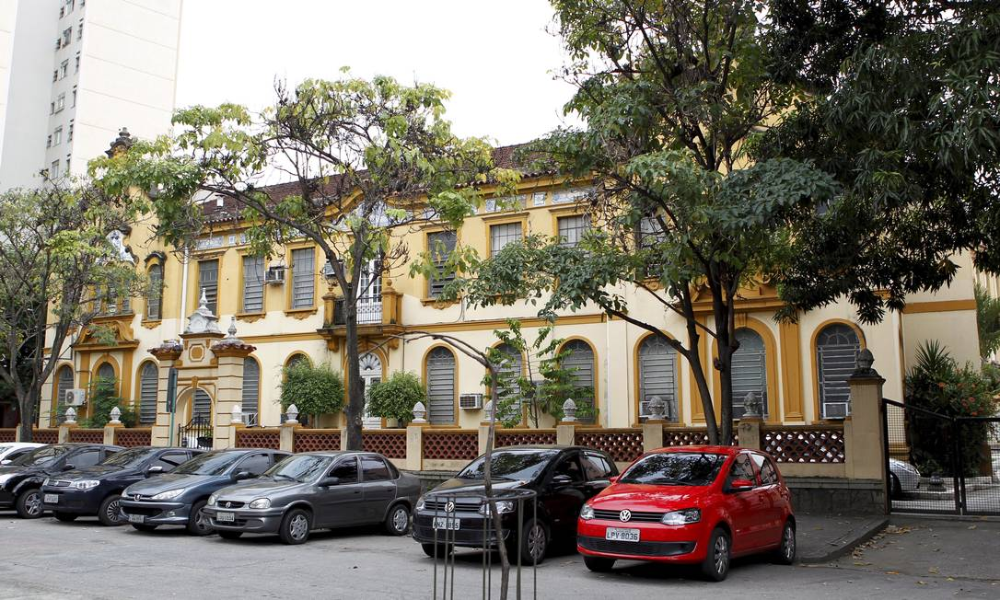

---

# Ensino 📚

Foco: <u>Física de Partículas</u>

    

        <h3>Aulas 👩‍🏫</h3>
        <ul>
            <li>Em Português e Inglês</li>
        </ul>
    

    

        <h3>Materiais 🛠️</h3>
        <ul>
            <li>Disponibilizados na plataforma online da universidade</li>
            <li>Livros em bibliotecas</li>
        </ul>
    

    

        <h3>Carga de trabalho 😮‍💨</h3>
        
Semelhante a MEFT

    

    

        <h3>Dificuldade do Curso 🪖</h3>
        
Semelhante a MEFT

    

    

        <h3>Horário ⏰</h3>
        
Carga horária semelhante a MEFT

    

    

        <h3>Avaliação 📝</h3>
        <ul>
            <li>Apresentações</li>
            <li>Artigos</li>
        </ul>
        
<u>Nota:</u> a maior parte das cadeiras eram de doutorado (grau equivalente a doutoramento) em vez de mestrado

    

    

        <h3>Opções Extra 🏅</h3>
        <ul>
            <li>A universidade permite ter tempo para atividades extra académicas:</li>
            <li>churrascos</li>
            <li>sair à noite</li>
            <li>ir à praia.</li>
            <!-- Add more options here -->
        </ul>
    

### Equivalências

    

        <h4>1º Semestre</h4>
        <ul>
            <li>Mecânica Quântica;</li>
            <li>Ótica e Lasers;</li>
            <li>Opções Livres.</li>
        </ul>
    

---

# Qualidade de Vida ❤️

    

        <h3>Alojamento 🏡</h3>
        <ul>
            <li>Fácil de arranjar na residência da universidade dentro do campus:</li>
            <li>Custo 200€/semestre</li>
            <li>Boa qualidade</li>
        </ul>
    

    

        <h3>Transportes 🚌</h3>
        <ul>
            <li>Relação preço-qualidade muito boa</li>
            <li>Muito baratos, dentro e para fora da cidade.</li>
        </ul>
    

---

# Informações Extra ➕

Não houve bolsa.

A cidade é bastante segura e as pessoas são simpáticas!
