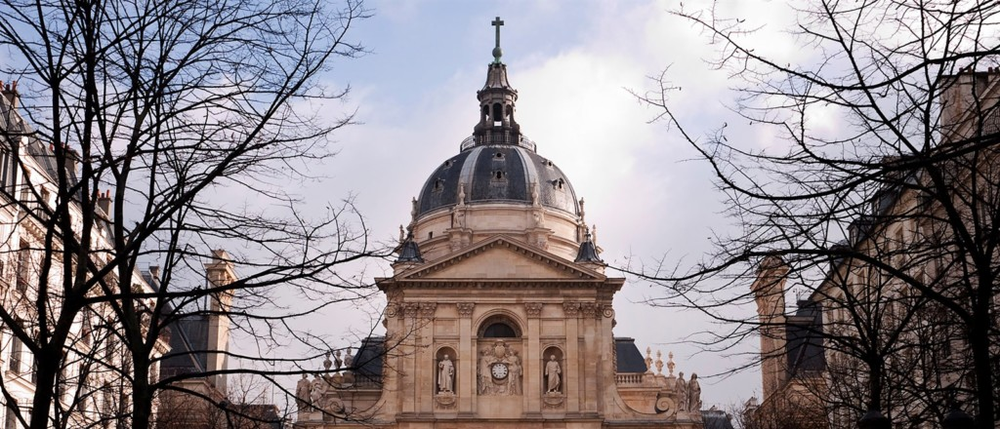

---



---

# Ensino 📚

<u>Foco:</u> Física, em particular Física Quântica, de Partículas, Nuclear e Astrofísica

<div style="display: flex;">
    <div style="flex-basis: 48%;">
        <h3>Aulas 👩‍🏫</h3>
        <ul>
            <li>Em Inglês</li>
        </ul>
    </div>
    <div style="flex-basis: 48%;">
        <h3>Materiais 🛠️</h3>
        <ul>
            <li>Os manuais/notas dos professores são bastante bons.</li>
        </ul>
    </div>
</div>

<div style="display: flex;">
    <div style="flex-basis: 48%;">
        <h3>Fatores mais pessoais 🙍‍♂️</h3>
        <ul>
            <li>Bibliotecas têm todos os livros necessários</li>
        </ul>
    </div>
</div>
<div style="display: flex;">
    <div style="flex-basis: 48%;">
        <h3>Carga de trabalho 😮‍💨</h3>
        <ul>
            <li>Inferior a MEFT</li>
        </ul>
    </div>
    <div style="flex-basis: 48%;">
        <h3>Dificuldade do Curso 🪖</h3>
        <ul>
            <li>Inferior a MEFT</li>
        </ul>
    </div>
</div>

<div style="display: flex;">
    <div style="flex-basis: 48%;">
        <h3>Horário ⏰</h3>
        <ul>
            <li>Consoante as cadeiras escolhidas</li>
            <li>Sobreposições podem ocorrer</li>
            <li>Carga horária baixa</li>
            <li>Aulas sobretudo de manhã</li>
        </ul>
    </div>
    <div style="flex-basis: 48%;">
        <h3>Avaliação 📝</h3>
        <ul>
            <li>Avaliação é só por exames (sem alternativas)</li>
            <li>Com uma única fase</li>
            <li>Numa semana com exames todos os dias</li>
        </ul>
        <p>Esta única hipótese:</p>
        <ul>
            <li>dificulta imenso</li>
            <li>protege pouco os alunos</li>
        </ul>
    </div>
</div>

### Equivalências 📜

#### 1º Semestre ❄️

-   Complementos de Mecânica Quântica;
-   Relatividade e Cosmologia;
-   Métodos Experimentais em Física de Partículas;
-   Física Nuclear;
-   Física de Partículas;
-   Astrofísica.

---

# Qualidade de Vida ❤️

<div style="display: flex;">
    <div style="flex-basis: 48%;">
        <h3>Alojamento 🏡</h3>
        <ul>
            <li>Bastante difícil de arranjar</li>
            <li>Melhor opção: conseguir ficar na Cité Université, (necessária candidatura imediata).</li>
            <li>Na residência universitária os quartos custam 350-500 € (é mais difícil arranjar sem partilhar quarto, que são mais em conta)</li>
            <li>Alojamento na residência universitária é bastante bom</li>
        </ul>
    </div>
    <div style="flex-basis: 48%;">
        <h3>Transportes 🚌</h3>
        <ul>
            <li>Há muitos meios de transporte</li>
            <li>Impecáveis e baratos</li>
            <li>Bastantes descontos para estudantes em Paris</li>
        </ul>
    </div>
</div>

---

# Quotes 🎙️

```
Estudar fora deu-me uma nova perspetiva.
```

---

# Informações Extra ➕

Os produtos básicos são de boa qualidade e fáceis de arranjar

Em geral, as pessoas são pouco hospitaleiras e simpáticas.
