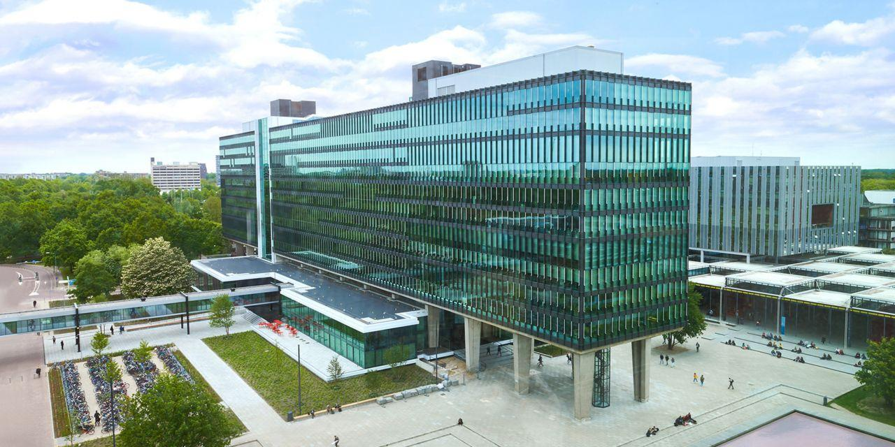

---



---

# Ensino

<div style="display: flex;">
    <div style="flex-basis: 48%;">
        <h3>Aulas 👩‍🏫</h3>
        <ul>
            <li>Em Inglês</li>
        </ul>
    </div>
    <div style="flex-basis: 48%;">
        <h3>Materiais 📚</h3>
        <ul>
            <li>Disponibilizados</li>
            <ul>
                <li>slides</li>
                <li>gravações das aulas</li>
                <li>resumos</li>
                <li>exercícios resolvidos como apoio ao estudo</li>
            </ul>
        </ul>
    </div>
</div>

<div style="display: flex;">
    <div style="flex-basis: 48%;">
        <h3>Fatores mais pessoais 🙍‍♂️</h3>
        <ul>
            <li>Espaços na faculdade propícios para o estudo:</li>
            <ul>
                <li>bibliotecas</li>
                <li>salas de estudo</li>
            </ul>
            <li>Os professores são bons e mostram-se em geral disponíveis para responder a dúvidas ou questões.</li>
            <li>Os serviços administrativos também são bons.</li>
        </ul>
    </div>
    <div style="flex-basis: 48%;">
        <h3>Carga de trabalho ⏰</h3>
        <p>Ligeiramente menor que MEFT</p>
        <h3>Dificuldade do Curso 🪖</h3>
        <p>Inferior a MEFT</p>
    </div>
</div>

<div style="display: flex;">
    <div style="flex-basis: 48%;">
        <h3>Horário ⏰</h3>
        <ul>
            <li>Número de horas de aulas é menor que em MEFT</li>
            <li>Varia consoante as cadeiras que se escolha no curso.</li>
        </ul>
    </div>
    <div style="flex-basis: 48%;">
        <h3>Avaliação 🧐</h3>
        <ul>
            <li>Exames orais e/ou escritos</li>
            <li>Projetos</li>
            <li>Depende da cadeira.</li>
        </ul>
    </div>
</div>

### Equivalências

#### 1º Semestre

-   Tecnologias Energéticas;
-   Nanotecnologia;
-   Nanotecnologias e Nanoelectrónica.

---

# Qualidade de Vida ❤️

<div style="display: flex;">
    <div style="flex-basis: 48%;">
        <h3>Alojamento 🏡</h3>
        <ul>
            <li>Razoavelmente boas</li>
            <li>Por volta dos 400-450€.</li>
        </ul>
    </div>
    <div style="flex-basis: 48%;">
        <h3>Transportes 🚌</h3>
        <h4>Dentro da cidade</h4>
        <ul>
            <li>São aceitáveis</li>
            <li>Não muito caros</li>
        </ul>
        <h4>Para fora da cidade</h4>
        <ul>
            <li>São pouco frequentes,</li>
            <li>Boa relação qualidade/preço.</li>
        </ul>
    </div>
</div>

---

# Quotes 🎙️

```
É uma experiência enriquecedora como costumam dizer, dá para conhecer novos tipos de
pessoas e experimentar uma nova vida durante uns tempos.
Também dá nos maiores capacidades de nos adaptarmos e de explorarmos um país novo.
```
