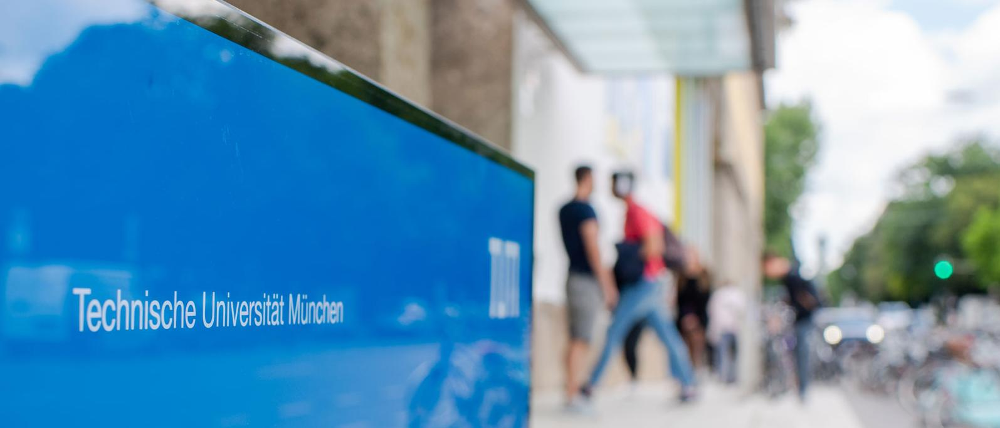

---



---

# Ensino 📚

<u>Foco:</u> Física e Engenharia Física

<!-- Aulas Section -->
<div style="display: flex;">
    <div style="flex-basis: 48%;">
        <h3>Aulas 👩‍🏫</h3>
        <ul>
            <li>Principalmente em Inglês</li>
            <li>Algumas cadeiras em Alemão</li>
        </ul>
    </div>
    <div style="flex-basis: 48%;">
        <h3>Materiais 📚</h3>
        <ul>
            <li>Disponibilizados na plataforma online da universidade</li>
            <li>Livros em bibliotecas</li>
        </ul>
    </div>
</div>

<!-- Fatores mais pessoais Section -->
<div style="display: flex;">
    <div style="flex-basis: 48%;">
        <h3>Fatores mais pessoais 🙍‍♂️</h3>
        <ul>
            <li>Qualidade de ensino boa</li>
            <li>Proximidade entre os docentes e os alunos</li>
            <li>Ótima qualidade serviços académicos</li>
            <li>Ótima disponibilidade de sitios para estudar</li>
        </ul>
    </div>
    <div style="flex-basis: 48%;">
        <h3>Carga de trabalho ⏰</h3>
        <p>Média</p>
        <h3>Dificuldade do Curso 🪖</h3>
        <p>Média</p>
    </div>
</div>

<!-- Horário Section -->
<div style="display: flex;">
    <div style="flex-basis: 48%;">
        <h3>Horário ⏰</h3>
        <ul>
            <li>Consoante as cadeiras escolhidas</li>
            <li>Sobreposições podem ocorrer</li>
            <li>Carga horária baixa</li>
            <li>Aulas sobretudo de manhã</li>
        </ul>
    </div>
    <div style="flex-basis: 48%;">
        <h3>Avaliação 🧐</h3>
        <ul>
            <li>testes</li>
            <li>exames</li>
            <li>provas orais</li>
        </ul>
    </div>
</div>

<!-- Opções Extra Section -->
<div style="display: flex;">
    <div style="flex-basis: 48%;">
        <h3>Opções Extra 🏅</h3>
        <ul>
            <li>Atividades extra-curriculares:</li>
            <ul>
                <li>cursos de línguas</li>
                <li>desportos</li>
                <li>(...)</li>
            </ul>
        </ul>
    </div>
</div>

#### Equivalências

<div style="display: flex;">
    <div style="flex-basis: 48%;">
        <h4>1º Semestre</h4>
        <ul>
            <li>Astrofísica;</li>
            <li>Nanotecnologias e Nanoeletrónica;</li>
            <li>Física e Tecnologia de Plasmas;</li>
            <li>Instrumentação;</li>
            <li>Opcionais Livres.</li>
        </ul>
    </div>
    <div style="flex-basis: 48%;">
        <h4>2º Semestre</h4>
        <ul>
            <li>Introdução à Investigação;</li>
            <li>Tecnologias Energéticas;</li>
            <li>Tecnologia Nuclear e de Física de Partículas;</li>
            <li>Ótica e Lasers;</li>
            <li>Astrofísica;</li>
            <li>Opcionais Livres.</li>
        </ul>
    </div>
</div>

---

# Qualidade de Vida ❤️

<div style="display: flex;">
    <div style="flex-basis: 48%;">
        <h3>Alojamento 🏡</h3>
        <ul>
            <li>Boas e por volta de 400-450€</li>
        </ul>
    </div>
    <div style="flex-basis: 48%;">
        <h3>Transportes 🚌</h3>
        <h4>Dentro da cidade</h4>
        <ul>
            <li>Aceitáveis</li>
            <li>Não muito caros</li>
        </ul>
        <h4>Para fora da cidade</h4>
        <ul>
            <li>Pouco frequentes</li>
            <li>Boa relação qualidade/preço</li>
        </ul>
    </div>
</div>

---

# Quotes 🎙️

```
Recomendo vivamente a cidade de Munique como escolha para fazer
Erasmus, e em particular a TUM
```

---

# Informação Extra ➕

Os alunos que frequentaram esta faculdade tiveram bolsa de estudo, mas disseram que esta não chegou para as despesas necessárias. <u>A cidade é bastante segura.</u>
Informações extra [aqui](https://docs.google.com/document/d/16rxoFQBVPXwgE1D9TChpHvunQHEMwpYfS62ouD-tFZg/edit).
