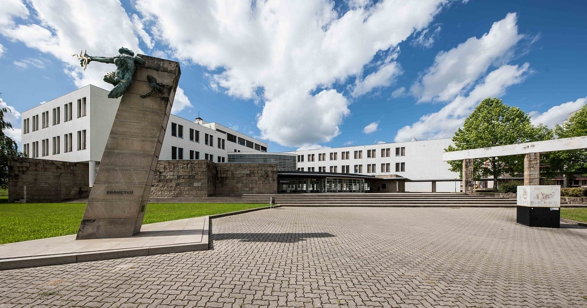

---

---

# Ensino 📚

<u>Foco:</u> Nanotecnologias e Matéria Condensada

    

        <h3>Aulas 👩‍🏫</h3>
        <ul>
            <li>Em Português</li>
        </ul>
    

    

        <h3>Materiais 🛠️</h3>
        <ul>
            <li>Meios de estudo disponibilizados bastante semelhantes aos disponibilizados no técnico.</li>
        </ul>
    

<!-- Fatores mais pessoais Section -->

    

        <h3>Fatores mais pessoais 🙍‍♂️</h3>
        <ul>
            <li>Existe um laboratório/centro de investigação em Braga dedicado a Nanotecnologias e à Matéria Condensada</li>
            <li>O ensino tem boa qualidade</li>
            <li>As relações estabelecidas com os docentes são bastante boas</li>
            <li>Os serviços académicos/administrativos são muito eficientes e prestáveis</li>
            <li>Existem variados espaços de estudo para os alunos, que são bastante agradáveis</li>
        </ul>
    

    

        <h3>Carga de trabalho 😮‍💨</h3>
        <ul>
            <li>Muito leve</li>
        </ul>
        <h3>Dificuldade do Curso 🪖</h3>
        <ul>
            <li>Baixa</li>
        </ul>
    

<!-- Horário Section -->

    

        <h3>Horário ⏰</h3>
        <ul>
            <li>Carga horária muito leve (2 dias livres por semana)</li>
        </ul>
    

    

        <h3>Avaliação 📝</h3>
        <ul>
            <li>Testes</li>
            <li>Apresentações</li>
            <li>Trabalhos</li>
        </ul>
    

### Equivalências 📜

    

        <h4>1º Semestre ❄️</h4>
        <ul>
            <li>Técnicas Matemáticas da Física;</li>
            <li>Mecânica Quântica I e II;</li>
            <li>Astrofísica;</li>
            <li>Eletrodinâmica Clássica;</li>
            <li>Física dos Meios Contínuos;</li>
            <li>Opções livres.</li>
        </ul>
    

    

        <h4>2º Semestre ☀️</h4>
        <ul>
            <li>Mecânica Quântica I e II;</li>
            <li>Física do Estado Sólido;</li>
            <li>Física Estatística.</li>
        </ul>
    

---

# Qualidade de Vida ❤️

    

        <h3>Alojamento 🏡</h3>
        <ul>
            <li>Fácil de encontrar um alojamento/quarto alugado em casa partilhada de boa qualidade</li>
            <li>Procurar através de:
                <ul>
                    <li>websites</li>
                    <li>grupos de redes sociais</li>
                </ul>
            </li>
            <li>O preço médio de Braga ronda os 275€/mês.</li>
        </ul>
    

    

        <h3>Transportes 🚌</h3>
        <h4>Dentro da cidade</h4>
        <ul>
            <li>Bastante bons na zona central da cidade</li>
            <li>Boa relação qualidade/preço</li>
        </ul>
        <h4>Para fora da cidade</h4>
        <ul>
            <li>Pouco frequentes</li>
            <li>Boa relação qualidade/preço</li>
        </ul>
    

---

# Informação Extra ➕

Supermercados têm uma boa relação qualidade/preço .

O curso permite a conciliação com atividades extracurriculares. As pessoas da universidade são muito simpáticas e sempre prontas a ajudar (e/ou a convidar para ir sair).

A cidade é muito segura!
