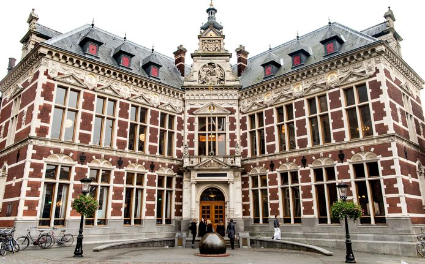

---



---

# Ensino

<u>Curso:</u> Mestrado em Física Teórica

<div style="display: flex;">
    <div style="flex-basis: 48%;">
        <h3>Aulas</h3>
        <ul>
            <li>Em Inglês</li>
        </ul>
    </div>
    <div style="flex-basis: 48%;">
        <h3>Materiais</h3>
        <ul>
            <li>Os professores disponibilizam tudo o que é necessário</li>
        </ul>
    </div>
</div>

<!-- Fatores mais pessoais Section -->
<div style="display: flex;">
    <div style="flex-basis: 48%;">
        <h3>Fatores mais pessoais</h3>
        <ul>
            <li>Muitos espaços de estudo</li>
            <li>Ótima qualidade de ensino</li>
            <li>Docentes muito disponíveis</li>
            <li>Excelentes serviços administrativos</li>
        </ul>
    </div>
    <div style="flex-basis: 48%;">
        <h3>Carga de trabalho</h3>
        <p>Mais baixa que MEFT</p>
        <h3>Dificuldade do Curso</h3>
        <p>Mais baixa que MEFT</p>
    </div>
</div>

<!-- Horário Section -->
<div style="display: flex;">
    <div style="flex-basis: 48%;">
        <h3>Horário</h3>
        <ul>
            <li>Carga horária um pouco mais leve que MEFT:</li>
            <ul>
                <li>Aulas obrigatórias, 3 vezes por semana (tarde inteira)</li>
            </ul>
        </ul>
    </div>
    <div style="flex-basis: 48%;">
        <h3>Avaliação</h3>
        <ul>
            <li>Avaliação contínua: fichas semanais</li>
            <li>Exames finais</li>
            <li>Midterms</li>
        </ul>
    </div>
</div>

<!-- Opções Extra Section -->
<div style="display: flex;">
    <div style="flex-basis: 48%;">
        <h3>Opções Extra</h3>
        <ul>
            <li>Muito tempo para atividades extracurriculares</li>
        </ul>
    </div>
</div>

<!-- Equivalências Section -->

### Equivalências

<div style="display: flex;">
    <div style="flex-basis: 48%;">
        <ul>
            <li><strong>1º Semestre</strong></li>
            <ul>
                <li>Física de Partículas;</li>
                <li>Teoria de Campo;</li>
                <li>Física da Matéria Condensada;</li>
                <li>Relatividade;</li>
                <li>Complementos de Mecânica Quântica.</li>
            </ul>
        </ul>
    </div>
</div>

---

# Qualidade de Vida ❤️

<div style="display: flex;">
    <div style="flex-basis: 48%;">
        <h3>Alojamento</h3>
        <ul>
            <li>Opções Alojamento sugeridas pela universidade:</li>
            <ul>
                <li>Alojamento para estudantes é extremamente escasso</li>
                <li>Preços: pelo menos 400 e 500 euros/mês</li>
                <li>Boa qualidade nos alojamentos</li>
            </ul>
            <u>Sugestão:</u> Tentar saber em que dia a universidade abre as candidaturas para as residências, também escassas, mas é a melhor hipótese
        </ul>
    </div>
    <div style="flex-basis: 48%;">
        <h3>Transportes</h3>
        <ul>
            <li>Ótimos meios de transporte dentro da cidade e no país</li>
            <li>Preços bastante elevados</li>
            <li>Compensa mais alugar/comprar bicicleta pois as bicicletas são muito baratas</li>
        </ul>
    </div>
</div>

---

# Quotes 🎙️

```
Estudar fora permite experimentar uma nova abordagem de ensino.
```

---

# Informações Extra ➕

O custo de vida é caro.

Lojas para comprar o essencial muito perto das residências, mas overall muito caro. Cidade extremamente segura, com pessoas com muita hospitalidade! A maior parte das pessoas fala ingles fluente na Holanda.

Atividades extracurriculares são as tipicas de estereótipos na Holanda.
