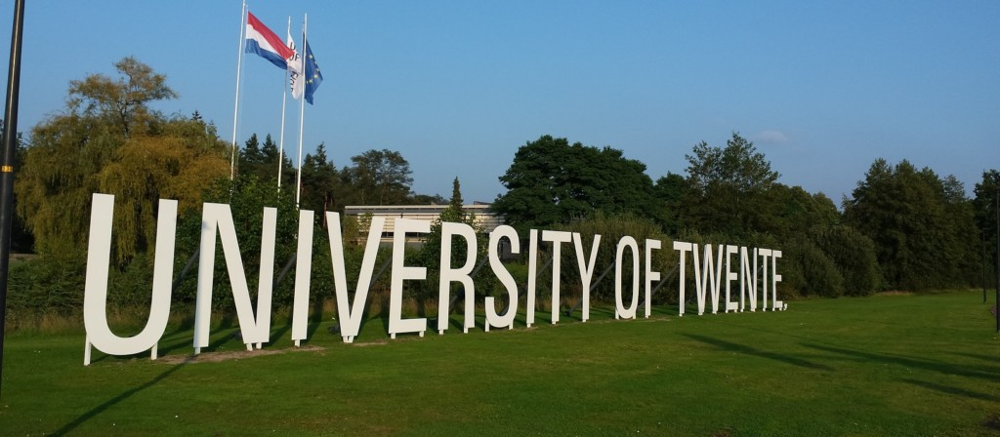

---



---

# Ensino

<u>Foco:</u> Aplicações de Matéria Condensada como Supercondutividade, e Ótica e Lasers

<div style="display: flex;">
    <div style="flex-basis: 48%;">
        <h3>Aulas</h3>
        <ul>
            <li>Em Inglês</li>
        </ul>
    </div>
    <div style="flex-basis: 48%;">
        <h3>Materiais</h3>
        <ul>
            <li>Bibliografia sugerida</li>
            <li>Sebentas organizadas pelos professores</li>
            <li>Exceção: Pode haver uma cadeira autodidática</li>
        </ul>
    </div>
</div>

<!-- Fatores mais pessoais Section -->
<div style="display: flex;">
    <div style="flex-basis: 48%;">
        <h3>Fatores mais pessoais</h3>
        <ul>
            <li>Bibliotecas com acesso a computadores</li>
            <li>Salas de estudo</li>
            <li>Pouca disponibilidade de espaços de estudo</li>
            <li>Qualidade do ensino é parecida com MEFT</li>
            <li>Proximidade com os docentes parecida com MEFT</li>
            <li>Bons serviços administrativos</li>
        </ul>
    </div>
    <div style="flex-basis: 48%;">
        <h3>Localização</h3>
        <p>Enschede</p>
    </div>
</div>

<!-- Carga de trabalho Section -->
<div style="display: flex;">
    <div style="flex-basis: 48%;">
        <h3>Carga de trabalho</h3>
        <p>Quase nula comparada com MEFT</p>
    </div>
    <div style="flex-basis: 48%;">
        <h3>Dificuldade do Curso</h3>
        <p>Média</p>
    </div>
</div>

<!-- Horário Section -->
<div style="display: flex;">
    <div style="flex-basis: 48%;">
        <h3>Horário</h3>
        <ul>
            <li>Cadeiras estruturadas em quartis de 15 ECT's cada</li>
            <ul>
                <li>2 quartis por semestre de 3 cadeiras</li>
                <li>8 semanas/quartil</li>
                <li>2 semanas para exames</li>
            </ul>
            <li>Carga horária leve: 12 a 15 horas de aulas por semana</li>
        </ul>
    </div>
    <div style="flex-basis: 48%;">
        <h3>Avaliação</h3>
        <ul>
            <li>Trabalhos de casa para avaliação</li>
            <li>Exames</li>
            <li>Apresentações</li>
            <li>Possivelmente orais</li>
        </ul>
    </div>
</div>

<!-- Equivalências Section -->
<div style="display: flex;">
    <div style="flex-basis: 48%;">
        <h3>Equivalências</h3>
        <ul>
            <li><strong>1º Semestre</strong></li>
            <ul>
                <li>Óptica e Lasers;</li>
                <li>Física da Matéria Condensada;</li>
                <li>Complementos de Mecânica Quântica;</li>
                <li>Física de Partículas;</li>
                <li>Nanotecnologias e Nanoeletrónica;</li>
                <li>Introdução à Investigação.</li>
            </ul>
        </ul>
    </div>
</div>

---

### Qualidade de Vida ❤️

<div style="display: flex;">
    <div style="flex-basis: 48%;">
        <h3>Alojamento</h3>
        <ul>
            <li>Rendas:</li>
            <ul>
                <li>quartos extremamente pequenos: desde 200-500 €/mês</li>
                <li>quartos mobilados: não a menos de 350 €</li>
                <li>Excelente qualidade nos alojamentos</li>
            </ul>
            <li>Como encontrar:</li>
            <ul>
                <li>em websites, (a própria universidade tem um serviço que ajuda na procura, mas que só está disponível depois de se estar registado na universidade)</li>
                <li>recursos escassos para procurar alojamento</li>
                <li>extremamente difícil mesmo online.</li>
            </ul>
            <li>Onde viver:</li>
            <ul>
                <li>cidade mais perto da faculdade: Enschede (onde a maior parte dos estudantes vivem.)</li>
                <li>Gronau na Alemanha, na fronteira com a Holanda</li>
            </ul>
            <u>Sugestão:</u> pedir contactos de alunos que já tenham ido.
        </ul>
    </div>
    <div style="flex-basis: 48%;">
        <h3>Transportes</h3>
        <ul>
            <li>Muito bons dentro da cidade e no país</li>
            <li>Preços razoavelmente elevados</li>
            <li>Compensa mais alugar/comprar bicicleta pois a cidade tem condições ótimas para tal meio</li>
            <li>Todas as estradas são super largas para ter ciclovias de vários sentidos, com sinalização luminosa específica, e sítios para deixar a bicicleta.</li>
            <li>Comboios baratos (max 25€ para atravessar o país todo).</li>
        </ul>
    </div>
</div>

---

### Lazer 🪩

-   complexo desportivo com imensas equipas desportivas (incluíndo desportos aquáticos)
-   parede de escalada ao longo de um dos prédios residenciais
-   cursos de línguas estrangeiras (incluíndo holandês, o que pode ser útil).

Os alunos costumam receber bolsa de estudo, que em geral não é de todo suficiente devido ao elevado custo de vida. Alimentação mais cara do que em Portugal.

Lojas para comprar o essencial muito perto das residências, com uma boa relação preço qualidade. Cidade extremamente segura, com pessoas com muita hospitalidade! Quase toda a gente fala Inglês e são todos muito bem educados.

---

# Quotes 🎙️

```
Mesmo considerando as restrições por causa da pandemia, não me arrependo nem um
segundo de ter ido para a Holanda. Acho que é uma oportunidade espetacular de ir um
bocado à descoberta
```
